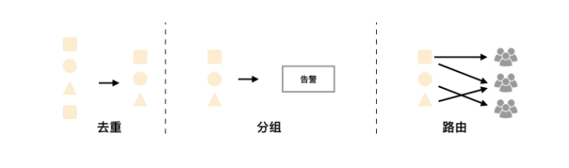

# Prometheus Alertmanager

---

## 简介

告警能力在Prometheus中是独立出来的部分。如下图所示，通过在Prometheus中定义AlertRule（告警规则），Prometheus会周期性的对告警规则进行计算，如果满足告警触发条件就会向Alertmanager发送告警信息。

<div align="center"><p></p>
<p>Prometheus告警处理</p></div>

Prometheus的告警规则一般有以下几部分：

* 告警名称：用户为告警规则命名，最好可以直接表达出该告警的主要内容
* 告警规则：告警规则实际是一组PromQL，即当PromQL查询结果持续多长时间后发出告警

在Prometheus中，还可以通过Group（告警组）对一组相关的告警进行统一定义，这些定义都是通过YAML文件来统一管理的。

Alertmanager是一个单独的组件，用以处理来自Prometheus Server或其它客户端的告警信息。它可以对这些信息进行进一步处理。比如，当接收到大量重复告警时能够消除重复的告警信息，同时对告警信息进行分组并且路由到正确的通知方。Prometheus内置了对邮件、Slack等多种方式的支持，同时还支持与Webhook集成，以支持更多定制化的场景。例如，Alertmanager目前不支持钉钉，那么我们可以给通过Webhook与钉钉机器人进行集成，从而通过钉钉接收告警信息。

Alertmanager还提供了静默和告警抑制机制来对告警通知行为进行优化。

---

## Alertmanager特性

<div align="center"><p></p>
<p>Alertmanager特性</p></div>

### 分组

分组机制可以将详细的告警信息合并成一个通知。在某些情况下，比如由于系统宕机导致大量的告警被同时触发，在这种情况下分组机制可以将这些被触发的告警合并为一个告警通知，避免一次性接受大量的告警通知，而无法对问题进行快速定位。

例如，当集群中有数百个正在运行的服务实例，并且为每一个实例设置了告警规则。假如此时发生了网络故障，可能导致大量的服务实例无法连接到数据库，结果就会有数百个告警被发送到Alertmanager。

而作为用户，可能只希望能够在一个通知中中就能查看哪些服务实例收到影响。这时可以按照服务所在集群或者告警名称对告警进行分组，而将这些告警内聚在一起成为一个通知。

告警分组，告警时间，以及告警的接受方式可以通过Alertmanager的配置文件进行配置。

### 抑制

抑制是指当某一告警发出后，可以停止重复发送由此告警引发的其它告警的机制。

例如，当集群不可访问时触发了一次告警，通过配置Alertmanager可以忽略与该集群有关的其它所有告警。这样可以避免接收到大量与实际问题无关的告警通知。

抑制机制同样通过Alertmanager的配置文件进行设置。

### 静默

静默提供了一个简单的机制可以快速根据标签对告警进行静默处理。如果接收到的告警符合静默的配置，Alertmanager则不会发送告警通知。

静默设置需要在Alertmanager的Web页面上进行设置。

---

## Prometheus告警规则

Prometheus的告警规则实际是一组PromQL表达式定义的告警出发条件，由Prometheus后端对这些出发规则进行周期性计算，在满足触发条件时触发告警通知。默认情况下，用户可以通过Prometheus的Web界面查看这些告警规则以及告警的触发状态。当Promthues与Alertmanager关联之后，可以将告警发送到外部服务如Alertmanager中并通过Alertmanager可以对这些告警进行进一步的处理。

### 定义告警规则

以下是一条典型的告警规则：

```yaml
groups:
- name: example
  rules:
  - alert: HighErrorRate
    expr: job:request_latency_seconds:mean5m{job="myjob"} > 0.5
    for: 10m
    labels:
      severity: page
    annotations:
      summary: High request latency
      description: description info
```

在告警规则中，我们将一组相关的规则定义在一个group下，每个group下可以包含多条规则（rule）。通常一条告警规则包含以下几部分：

* alert：告警规则名称。
* exper：基于PromQL的告警触发条件，用于计算是否有时间序列满足该条件。
* for：评估等待时间。可选项，用于表示只有触发条件持续一段时间后才发送告警。在等待期间新产生的告警的状态为pending。
* labels：自定义标签，允许用户指定要附加到告警信息的上的一组附加标签。
* annotations：指定一组附加信息，比如用于描述告警详细信息的文字等。annotations的内容在告警产生时会一同作为参数发送到Alertmanager。

在Prometheus全局配置文件中，通过**rule_file**指定告警规则文件的访问路径可以使Prometheus启用告警规则。Prometheus启动后自动扫描这些路径下的规文件中定义的内容，并根据这些规则计算是否向外部发送通知：

```yaml
rule_files:
  [ - <filepath_glob> ... ]
```

默认情况下Prometheus会每分钟对这些规则进行计算，如果用户想自定义自己的告警计算周期，可以通过`evaluation_interval`来覆盖默认的计算周期：

```yaml
global:
  [ evaluation_interval: <duration> | default = 1m ]
```

### 模块化

一般来说，在告警规则文件的annotations中使用`summary`描述告警的概要信息，`description`用于描述告警的详细信息。同时Alertmanager的UI也会根据这两个标签值，显示告警信息。为了让告警信息具有更好的可读性，Prometheus支持模板化label和annotations的中标签的值。

通过`$labels.<labelname>`变量可以访问当前告警实例中指定标签的值。`$value`则可以获取当前PromQL表达式计算的样本值。

```yaml
# To insert a firing element's label values:
{{ $labels.<labelname> }}
# To insert the numeric expression value of the firing element:
{{ $value }}
```

例如，可以通过模板化优化summary以及description的内容的可读性：

```yaml
groups:
- name: example
  rules:

  # Alert for any instance that is unreachable for >5 minutes.
  - alert: InstanceDown
    expr: up == 0
    for: 5m
    labels:
      severity: page
    annotations:
      summary: "Instance {{ $labels.instance }} down"
      description: "{{ $labels.instance }} of job {{ $labels.job }} has been down for more than 5 minutes."

  # Alert for any instance that has a median request latency >1s.
  - alert: APIHighRequestLatency
    expr: api_http_request_latencies_second{quantile="0.5"} > 1
    for: 10m
    annotations:
      summary: "High request latency on {{ $labels.instance }}"
      description: "{{ $labels.instance }} has a median request latency above 1s (current value: {{ $value }}s)"
```

### 查看告警状态

如下图所示，用户可以通过Prometheus的Web界面中的Alerts菜单查看当前Prometheus下的所有告警规则，以及当前所处的活动状态：

<div align="center"><p></p>
<p>告警活动状态</p></div>

同时对于已经pending或者firing的告警，Prometheus也会将他们存储到时间序列ALERTS{}中。

可以通过表达式，查询告警实例：

```
ALERTS{alertname="<alert name>", alertstate="pending|firing", <additional alert labels>}
```

样本值为1表示当前告警处于活动状态（pending或者firing），当告警从活动状态转换为非活动状态时，样本值则为0。  

---

> 声明：本作品采用[署名-非商业性使用-相同方式共享 4.0 国际 (CC BY-NC-SA 4.0)](https://creativecommons.org/licenses/by-nc-sa/4.0/deed.zh)进行许可，使用时请注明出处。
> Author: mengbin92
> Github: [mengbin92](https://mengbin92.github.io/)
> cnblogs: [恋水无意](https://www.cnblogs.com/lianshuiwuyi/)

---
