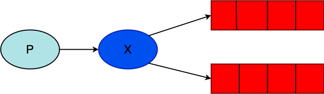
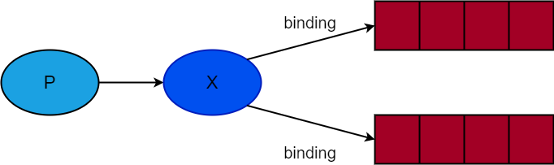
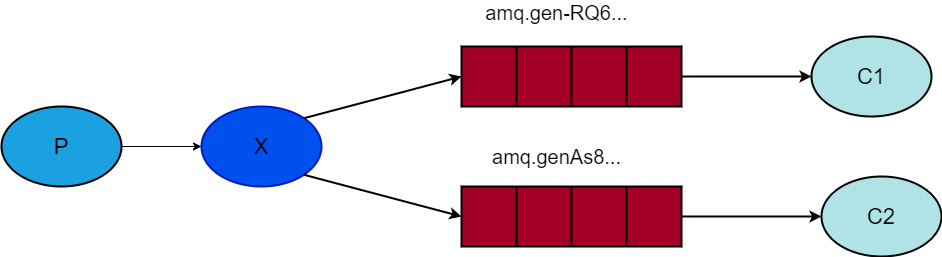

[toc]  

---

# 发布/订阅  

在上一章节，我们创建了一个工作队列。工作队列的核心是将任务均匀地分发给每个工作者。本章节中我们将做一些完全不同的改变 -- 我们将一个消费分发给多个消费者。这种模式被称为“发布/订阅”。  

为了说明这种模式，我们会构建一个简单的日志系统，它包括两个程序：一个用了来发布消息，另一用来接收并输出消息。  

在我们的日志系统中，接收程序的每个运行中的副本都会接收到消息。这样就可以一个程序接收消息并直接写入硬盘，另一个程序接收消息并输出到屏幕上。  

追根揭底，发布的日志消息会广播给所有的接收者。  

---  

## 1. Exchanges  

在上一章节中，我们发送和接收消息都是通过队列来完成的。现在是时候在RabbitMQ中引入完整的消息模型了。  

现在我们快速总结一下之前的教程：  

- *生产者*：发送消息的用户程序。
- *队列*：存储消息的缓存。
- *消费者*：接收消息的用户程序。  

RabbitMQ中消息模型的核心思想是生产者绝不直接将消息发送到队列。实际中，生产者甚至不会知道消息被分发到哪些队列中。  

生产者只是将消息发送给*交换机*。交换机的工作很简单：一边从生产者接收消息，另一边将消息推送给队列。交换机需要明确知道如何处理接收到的消息：消息应该发送给部分队列？还是大部分队列？还是要直接丢弃？这些规则由*交换机类型*决定。  

div align="center"></div>  

可用的交换机类型有：`direct`、`topic`、`handers`和`fanout`。现在我们只关心最后一个 -- `fanout`。接下来我们使用该类型创建一个名为`logs`的交换机：  

```go
err = ch.ExchangeDeclare(
		"logs",   // name
		"fanout", // type
		true,     // durable
		false,    // auto-deleted
		false,    // internal
		false,    // no-wait
		nil,      // arguments
	)
```  

fanout交换机很简单，正如名称所说，它只是把它收到的信息广播给它知道的队列。这也正是我们的日志服务所需要的。  

> **罗列出可用的交换机**
> 可以使用`rabbitmqctl`罗列出可用的交换机：`suo rabbitmqctl list_exchanges`
> 结果中包括`amq.*`交换机和默认（未命名）交换机。这些都是默认创建的，但现在你还用不到它们。  
> **默认交换机**
> 在之前的章节中，我们并不了解交换机，但也能向队列中发送消息。这是因为我们使用了默认的交换机，由空字符串定义的。
> 回顾下我们之前是如何发布消息的：
> ```go
> err = ch.Publish(
>		"",     // exchange
>		q.Name, // routing key
>		false,  // mandatory
>		false,  // immediate
>		amqp.Publishing{
>			ContentType: "text/plain",
>			Body:        []byte(body),
>})
> ```
> 这里我们使用默认/无名交换机：如果路由存在的话，消息会被路由到`routing_key`指定的队列中。  

现在，我们使用命名过的交换机来发送消息：  

```go
err = ch.ExchangeDeclare(
	"logs",   // name
	"fanout", // type
	true,     // durable
	false,    // auto-deleted
	false,    // internal
	false,    // no-wait
	nil,      // arguments
)
failOnError(err, "Failed to declare an exchange")

body := bodyFrom(os.Args)
err = ch.Publish(
	"logs", // exchange
	"",     // routing key
	false,  // mandatory
	false,  // immediate
	amqp.Publishing{
		ContentType: "text/plain",
		Body:        []byte(body),
})
```  

---  

## 2. 临时队列  

在之前的章节中，我们使用的是带有指定名称的队列。在之前的例子中，有名队列对我们是至关重要的 -- 因为我们需要将工作中指向同一个队列。当你想通过队列在生产者和消费者之间共享消息时，给队列命名是十分重要的。  

但这并不符合我们的日志服务场景。我们希望可以监听所有的日志信息，而不是部分信息。我们也只对当前流动的消息感兴趣，而不是陈旧的消息。要实现上面的要求，我们需要做到两件事：  

1. 首先，无论何时，我们连接到RabbitMQ，我们都需要一个新的空队列。我们需要创建一个随机名称的队列，如果服务器能为我们分配一个随机队列就更完美了。
2. 第二，当我们断开连接后，之前使用的队列应该被自动删除。  

在[amqp](http://godoc.org/github.com/streadway/amqp)客户端中，当使用空字符串命名队列时，我们会创建一个使用随机生成的名称命名的非持久队列：  

```go
q, err := ch.QueueDeclare(
	"",    // name
	false, // durable
	false, // delete when unused
	true,  // exclusive
	false, // no-wait
	nil,   // arguments
)
```  

此方法返回时，队列实例会包含一个有RabbitMQ生产的随机对列名称。例如，生成的队列名称类似`amq.gen-JzTY20BRgKO-HjmUJj0wLg`。  

当连接关闭时，这个队列会被删除，因为这个队列被声明为**独占**队列。  

关于`exclusive`标识和其他队列特性，详见[队列指南](https://www.rabbitmq.com/tutorials/queues.html)。  

---  

## 3、绑定  

<div align="center"></div>  

我们已经创建了fanout的交换机和队列。现在我们需要告诉交换机把消息发送给队列。交换机与队列之间的关系被称为*绑定*。  

```go
err = ch.QueueBind(
		q.Name, // queue name
		"",     // routing key
		"logs", // exchange
		false,
		nil,
)
```  

现在开始，`logs`交换机上消息就会被发送给我们的队列。  

---  

## 4、整合  

<div align="center"></div>  

生产者程序（发送消息）跟之前章节的并没有太多不同。最重要的改变就是我们现在要把消息发布到`logs`交换机上，而不是无名交换机。在发送时我们需要指定`routingKey`，但在fanout模式下，该值会被忽略。`emit_log.go`内容可以在[这里](http://github.com/rabbitmq/rabbitmq-tutorials/blob/master/go/emit_log.go)查看。  

在建立完连接之后，我们声明了交换机。因为禁止向不存在的交换机发布消息。  

如果没有队列绑定在交换机上，消息会遗失，但这对我们来说是可以接受的：如果没有消费者在监听，我们可以安全地丢弃消息。  

`receive_logs.go`内容可以在[这里](https://github.com/rabbitmq/rabbitmq-tutorials/blob/master/go/receive_logs.go)查看。  

如果你想保存日志到文件中，打开终端执行下面的命令：  

```bash
go run receive_logs.go > logs_from_rabbit.log
```  

如果你想在屏幕上查看日志，打开终端执行下面的命令：  

```bash
go run receive_logs.go
```  

发布消息：  

```bash
go run emit_log.go
```  

使用`rabbitmqctl list_bindings`命令可以确认是否绑定到了我们所想的队列。运行了两个`receive_logs.go`程序，你应该会看到类似的消息：  

```bash
sudo rabbitmqctl list_bindings
# => Listing bindings ...
# => logs    exchange        amq.gen-JzTY20BRgKO-HjmUJj0wLg  queue           []
# => logs    exchange        amq.gen-vso0PVvyiRIL2WoV3i48Yg  queue           []
# => ...done.
```  

结果显示来自`logs`交换机的消息去往两个服务分配名称的队列中。这正是我们所期望的。  

那么如何监听部分消息呢？参见[下一节](4.md)。

---

> 声明：本作品采用[署名-非商业性使用-相同方式共享 4.0 国际 (CC BY-NC-SA 4.0)](https://creativecommons.org/licenses/by-nc-sa/4.0/deed.zh)进行许可，使用时请注明出处。 
> Author: MonsterMeng92

---  
