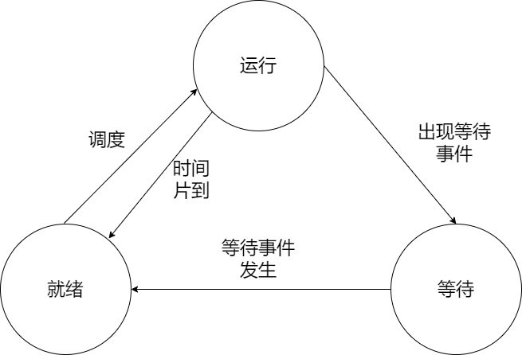
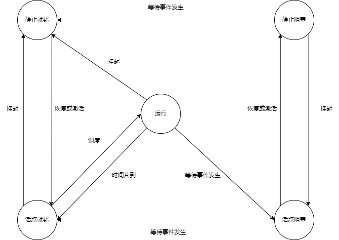

---
layout: post
title: 系统架构设计师备考之操作系统 
tags: [考证, 架构师]
mermaid: false
math: false
---  

## 考点  

- 操作系统的类型和结构
- 操作系统的基本原理
- 网络操作系统及网络管理
- 嵌入式操作系统与实时操作系统  

### 1. 操作系统的类型和结构  

操作系统是计算机系统中的核心系统软件，负责管理和控制计算机系统中硬件和软件资源，合理地组织计算机工作流程和有效地利用资源。在计算机与用户之间起接口的作用。  

操作系统根据使用环境和对作业的处理方式，操作系统分为以下**五种**：  

- **批处理操作系统**：将用户提交的作业分类，把一批中的作业编程一个作业执行序列。批处理操作系统又可分为*联机批处理*和*脱机批处理*。其主要特征有：
  - 用户脱机使用计算机
  - 成批处理
  - 多道程序运行
- **分时操作系统**：采用分时技术，使多个用户同时以*会话*方式控制自己程序的运行，每个用户都感觉到似乎各自有一台独立的、支持自己请求服务的系统。分时技术把处理机的运行时间分成很短的时间片，按时间片轮流把处理机分配给各联机作业使用。若某个作业在分配给它的时间片内不能完成其计算，则该作业暂时中断，把处理机让给另一作业使用，等待下一轮时间再继续运行。分时系统的主要特征有：  
  - 交互性
  - 多用户同时性
  - 独立性
- **实时操作系统**：往往是专用的，系统与应用很难分离，常常紧密结合在一起。实时系统并不强调资源的利用率，而更关心及时性（时间紧迫性）、可靠性和完整性。实时系统又分为*实时过程控制*和*实时信息处理*两种。其主要特征有：
  - 提供即时响应
  - 高可靠性
- **网络操作系统**：安装网络架构的各个协议标准进行开发，包括网络管理、通信、资源共享、系统安全和多种网络应用服务等。在网络系统中，各计算机的操作系统可以互不相同，它需要有一个支持异种计算机系统之间进程通信的网络环境，以实现协同工作和应用集成。其主要特征有：
  - 互操作性
  - 协作处理
- **分布式操作系统**：要求有一个统一的操作系统，实现系统操作的统一性，负责全系统的资源分配和调度，为用户提供统一的界面。它是一个逻辑上紧密耦合的系统。  

不管哪种操作系统，都应该具备5个基本功能：处理机管理、存储管理、设备管理、文件管理和作业管理。  

操作系统的结构分**五种**：  

- **无序结构**：又称整体结构或模块组合结构。它以*大型表格*和*队列*为中心，操作系统的各部分程序围绕着表格运行，整个系统是一个程序。这种操作系统又称*面向过程的操作系统*。操作系统由许多标准的、可兼容的基本单位（又称模块）构成，各模块相对独立，模块之间通过规定的接口相互调用。模块化设计方法的优点是缩短了系统的开发周期，缺点是模块之间调用关系负责、相互依赖，从而使分析、移植和维护系统容易出错。
- **层次结构**：把一个大型复杂的操作系统分解成若干个单向依赖的层次，有多层的正确性保证操作系统的可靠性。层次结构清晰，大大地简化了接口的设计，且有利于系统功能的增加或删改，易于保证可靠性，也便于维护和移植。
- **面向对象结构**，基于面向对象程序设计的概念，采用了各种不同的对象技术。在计算机系统中对象是操作系统管理的信息和资源的抽象，是一种抽象的数据类型。可以把对象作为系统中的最小单位，由对象、对象操作、对象保护组成的操作系统，就是面向对象的操作系统，如Windows Server中有执行体对象（例如，进程、线程、文件和令牌等）和内核对象（例如，时钟、事件和信号等）。面向对象结构的优点是适用于网络操作系统和分布式操作系统中。
- **对称多处理结构**。如果一个操作系统在系统中的所有处理机运行且共享同一内存（内存储器、主存、实存），这样的系统就是一个对称多处理系统。优点是适合共享存储器结构的多处理机系统，即紧耦合的多处理机系统。
- **微内核结构**。把系统的公共部分抽象出来，形成一个底层核心，提供最基本的服务，其他功能以服务器形式建立在微内核之上。它具有良好的模块化和结构化特征，模块之间和上下层之间通过消息来通信。建立在微内核上的服务器可以根据不同的需要构造，从而形成不同的操作系统。  

现代操作系统大多拥有两种工作状态：**内核态**和**用户态**。一般的应用程序工作在用户态，而内核模块和最基本的操作系统核心工作在内核态。  

微内核结构由一个非常简单的硬件抽象层和一组比较关键的原语或系统调用组成，这些原语仅包括建立一个系统必需的几个部分，如线程管理、地址空间和进程间通信等。微内核的目标是将系统服务的实现和系统的基本操作规则分离开来。  

微内核技术的主要优点如下：  

- 具有统一的接口，在用户态和内核态之间无需进程识别
- 可伸缩性好，能使用硬件更新和应用变化
- 可移植性好，所有与具体机器特征相关的代码，全部隔离在微内核中，如果操作系统要移植到不同的硬件平台上，只需修改微内核中极少代码即可
- 实时性好，微内核可以方便地支持实时处理
- 安全可靠性高，微内核将安全性作为系统内部特性来进行设计，对外仅使用少量应用编程接口
- 支持分布式系统，支持多处理器的架构和高度并行的应用程序
- 真正面向对象的操作系统

### 2. 处理器管理  

在单用户多任务的操作或多用户多任务的操作系统中，系统同时运行多个程序，这些程序的并行运行势必会到系统资源的使用产生竞争。因此，操作系统必须能够处理和管理这种并行运行的程序，使之对资源的使用安装良性的顺序进行。  

#### 2.1 进程的状态  

进程是一个程序关于某个数据集的一次运行。进程是程序的一次运行活动，是一个动态的概念，而程序是静态的概念，是指令的集合。在操作系统中，进程是进行系统资源分配、调度和管理的最小单位。从静态的观点看。进程由程序、数据和进程控制块（Process Control Block，PCB）组成；从动态的观点看，进程是计算机状态的一个有序集合。    

> 在现代操作系统中引入了线程的概念，它是处理器分配资源的最小单位  

PCB是进程存在的唯一标志，描述了进程的基本情况。其内容可以分为两部分：  

- 调度信息，供进程调度使用，包括进程当前的一些基本属性
- 执行信息，即现场，刻画了进程的执行情况  

为了便于管理进程，我们使用两种模型来表示进程管理。  

##### 三态模型  

根据进程在执行过程中不同状况，分为三种不同的进程状态：  

- 运行态：占有处理器正在运行
- 就绪态：具备运行条件，等待系统分配处理器以便运行
- 等待态（阻塞态）：不具备运行条件，正在等待某个事件的完成  

  
  
图1-1 进程三态模型及其状态转换

  

运行状态的进程将由于出现等待事件而进入等待状态，当等待事件结束之后等待状态的进程将进入就绪状态，而处理器的调度策略游湖引起运行状态和就绪状态之间的切换。引起进程状态转换的具体原因如下：  

- 运行态-->等待态：等待使用资源，如等待外设输入、等待人工干预
- 等待态-->就绪态：资源得到满足，如外设输入结束、人工干预完成
- 运行态-->就绪态：运行时间片到，出现有更高优先权进程
- 就绪态-->运行态：CPU空闲时选择一个就绪进程  

##### 五态模型   

三态模型总是假设所有的进程都在内存中。事实上，可能出现一些情况导致进程被挂起，引起进程挂起的原因有：  

- 系统中的进程均处于等待状态，处理器空闲，此时需要把一些阻塞进程对换出去，以腾出足够的内存装入就绪进程运行
- 进程竞争资源，导致系统资源不足，负载过重，此时需要挂起部分进程以调整系统负荷，保证系统的实时性或让系统正常运行
- 把一些定期执行的进程（如审计程序、监控程序、记账程序等）对换出去，以减少系统负荷
- 用户要求挂起自己的进程，以便根据中间执行情况和中间结果进行某些调试、检查和改正
- 父进程要求挂起自己的后代子进程，以进行某些检查和改正
- 操心系统需要挂起某些进程，检查运行中资源使用情况，以改善系统性能；或当系统出现故障或某些功能受到破坏时，需要挂起某些进程以排除故障

下图给出了具有挂起进程功能的系统中的进程状态。在此类系统中，进程增加了两个新状态：  

- 静止就绪态：表明进程具备运行条件但目前在二级存储器（外存储器、外存、辅存等）中，只有当它被对换到内存才能被调度执行  
- 静止阻塞态：表明进程正在等待某一个事件且在二级存储器中 

  
  
图1-2 具有挂起功能系统的进程状态及其转换

  

 引起进程状态的具体原因如下：  

 - 活跃阻塞态-->静止阻塞态：如果当前不存在活跃就绪进程，那么至少有一个等待态进程将被对换出去成为静止阻塞态；操作系统根据当前资源状况和性能要求，可以决定把活跃阻塞态进程对换出去成为静止阻塞态
 - 静止阻塞态-->静止就绪态：引起进程等待的事件发生之后，相应的静止阻塞态进程将转换为静止就绪态
 - 静止就绪态-->活跃就绪态：当内存中没有活跃就绪态进程，或者静止就绪态进程具有比活跃就绪态进程更高的优先级，系统将把静止就绪态进程转换成活跃就绪态
 - 活跃就绪态-->静止就绪态：操作系统根据当前资源状况和性能要求，也可以决定把活跃就绪态进程对换成静止就绪态
 - 静止阻塞态-->活跃阻塞态：当一个进程等待一个事件时，原则上不需要把它调入内存。但当一个进程退出后，内存已经有了一大块自由空间，而某个静止阻塞态进程具有较高的优先级且操作系统已经得知导致它阻塞的事件即将结束，此时便会发生这一状态变化  

挂起的进程是不在内存的进程，不参与进程调度，直到被对换进内存。其主要特征有：  

- 该进程不能立即被执行
- 挂起进程可能会等到一个事件，但多等待的事件是独立于挂起条件的，事件结束并不能导致进程具备执行条件
- 进程进入挂起状态时由于操作系统、父进程或进程本身阻止它的运行
- 结束进程挂起状态的命令只能通过操作系统或父进程发出
- 阻塞态：进入阻塞态通常是因为在等待I/O完成或等待分配到所需资源  

#### 2.2 信号量与PV操作  

考点：理解信号量与PV操作的基本概念，能够正确地理解在互斥、同步方面的控制用于，并能够灵活地运用。  

操作系统中，进程之间经常会存在互斥（都需要共享独占性资源时）和同步（完成异步的两个进程的协作）两种关系。为了有效地处理这两种情况，W.Dijstra在1965年提出**信号量**和**PV操作**：  

- 信号量：一种特殊的变量，表现形式是一个整形S和一个队列
- P操作：S=S-1，若S<0，进程暂停执行，进入等待队列
- V操作：S=S+1，若S<=0，唤醒等待队列中的一个进程  

##### 互斥控制  

互斥控制是为了保护共享资源，不让多个进程同时访问这个共享资源，即阻止多个进程同时进入访问这些资源的代码段，这个代码段称为临界区，而这个一次只允许一个进程访问的资源被称为临界资源。