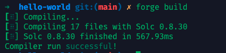
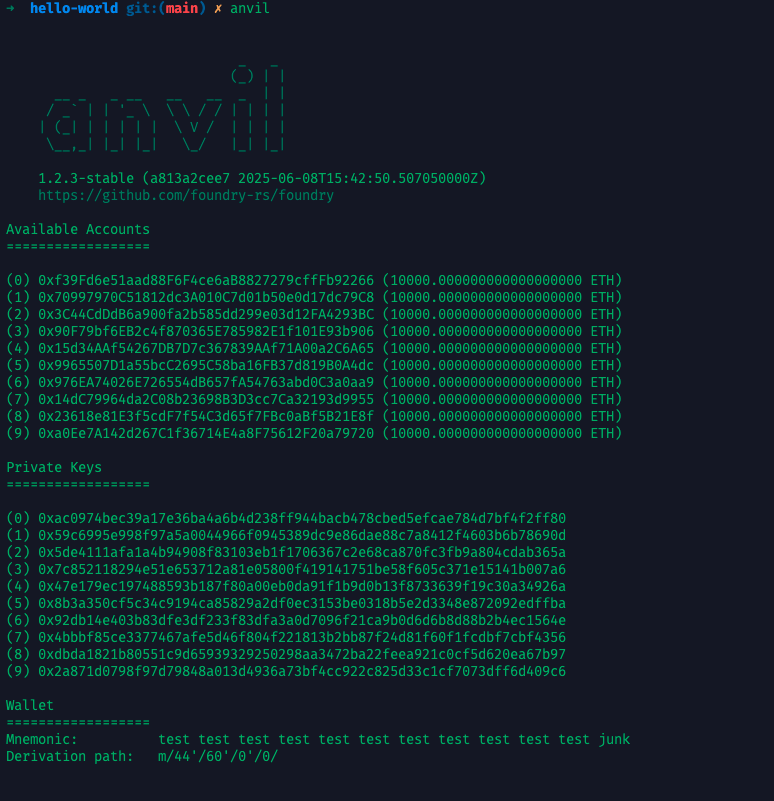
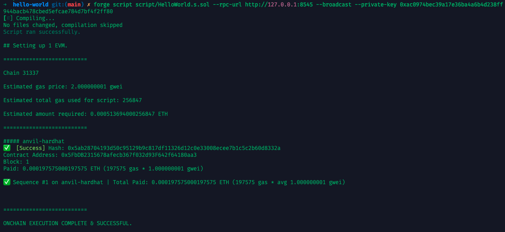
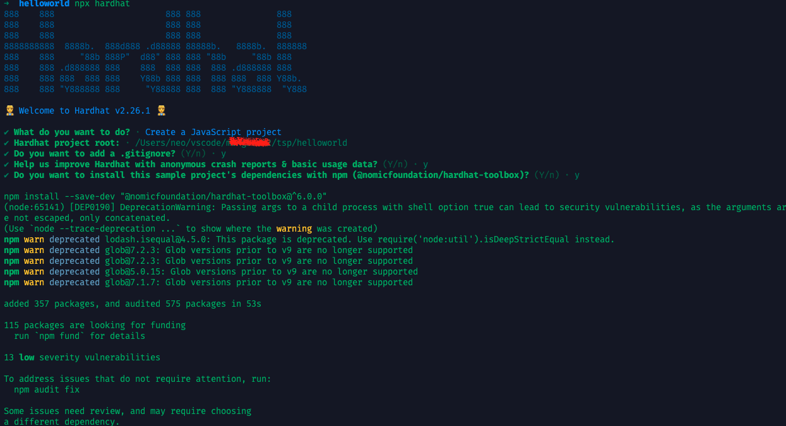
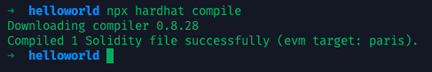
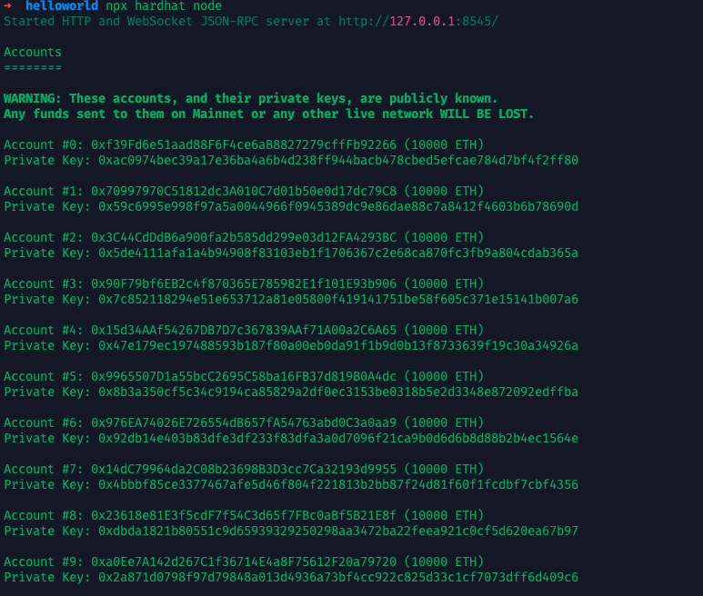

## 前置条件

* 推荐已经完成 [第 0 课](./2025-07-13-TSP-solidity00.md)，搭建好开发环境
* 已安装：
  * Node.js（用于 Hardhat）
  * 或 Foundry（用于 `forge`）
  * 或使用 Remix（可选 Web 环境）

---

## 实操方案一：使用 Foundry 部署 HelloWorld 合约

### 1. 创建项目

```bash
$ forge init hello-world
$ cd hello-world && tree -L 1
.
├── foundry.toml    # 项目的配置入口
├── lib/            # 依赖库目录，用于存放外部依赖（比如 openzeppelin-contracts）
├── README.md       # 项目说明文档
├── script/         # 脚本目录，部署或脚本自动化代码的位置
├── src/            # 主合约目录，所有生产环境要部署的合约都应该放在这里
└── test/           # 测试目录，所有测试合约放在这里
```

> 使用forge init 创建的项目中在 src、script和test目录下有项目的示例文件，在我们的 HelloWorld 合约中并不需要，所有需要将这些文件删除。

### 2. 编写合约

编辑 `src/HelloWorld.sol`：

```solidity
// SPDX-License-Identifier: MIT
pragma solidity ^0.8.0;

contract HelloWorld {
    string public greet = "Hello, World!";
}
```

### 3. 编译合约

```bash
$ forge build
```

你将看到：



### 4. 启动本地节点 + 部署（使用 Anvil）

我们可以使用 `anvil` 在本地启动一条测试链来部署我们的合约，通过 `http://127.0.0.1:8545`就可以访问测试链：

```bash
$ anvil
```



打开另一个终端，创建脚本 `script/HelloWorld.s.sol`：

```solidity
// SPDX-License-Identifier: MIT
pragma solidity ^0.8.0;

import "forge-std/Script.sol";
import "../src/HelloWorld.sol";

contract Deploy is Script {
    function run() external {
        vm.startBroadcast();
        new HelloWorld();
        vm.stopBroadcast();
    }
}
```

部署脚本运行：

```bash
$ forge script script/HelloWorld.s.sol --rpc-url http://127.0.0.1:8545 --broadcast --private-key 0xac0974bec39a17e36ba4a6b4d238ff944bacb478cbed5efcae784d7bf4f2ff80
```

输出会显示部署地址：



---

## 实操方案二：使用 Hardhat 部署 HelloWorld 合约

> Hardhat 我不怎么使用，所以下面的代码中可能误

### 1. 初始化项目

```bash
$ mkdir hello-hardhat
$ cd hello-hardhat
$ npm init -y
$ npm install hardhat
$ npx hardhat
```

选择 `Create a basic sample project`：



### 2. 编辑合约 `contracts/HelloWorld.sol`

```solidity
// SPDX-License-Identifier: MIT
pragma solidity ^0.8.0;

contract HelloWorld {
    string public greet = "Hello, Hardhat!";
}
```

### 3. 编译合约

```bash
$ npx hardhat compile
```



### 4. 启动本地链

```bash
$ npx hardhat node
```



Hardhat 会输出多个预置账户（含私钥），用于测试。

### 5. 创建部署脚本

编辑 `scripts/deploy.js`：

```javascript
const { ethers } = require("hardhat");

async function main() {
  const Hello = await ethers.getContractFactory("HelloWorld");
  const hello = await Hello.deploy(); // Already deployed here
  await hello.deployed(); // optional, but often included to wait for deployment

  console.log("Contract deployed to:", hello.address);
}

main().catch((error) => {
  console.error(error);
  process.exitCode = 1;
});
```

运行部署脚本：

```bash
$ npx hardhat run scripts/deploy.js --network localhost
```

### 6. 调用合约函数（可选）

创建 Hardhat 控制台：

```bash
$ npx hardhat console --network localhost
```

在控制台中输入：

```js
const HelloWorld = await ethers.getContractFactory("HelloWorld");
const hello = await HelloWorld.attach("部署时输出的地址");
await hello.greet();  // 应输出 "Hello, Hardhat!"
```

---

## （可选）方案三：使用 Remix 部署

打开 [https://remix.ethereum.org](https://remix.ethereum.org)

* 粘贴合约代码
* 编译后，点击“部署”
* 点击合约展开，可以看到 `greet` 值

---

## “纸上谈兵”提示

| 问题                             | 原因                                                 |
| :------------------------------- | :--------------------------------------------------- |
| 为何构造函数没用？               | 我们没定义 `constructor()`，所以默认不执行初始化逻辑 |
| public 变量为何自动生成 getter？ | Solidity 会自动为 `public` 状态变量生成只读函数      |
| 合约地址是怎么算出来的？         | 它基于部署者地址 + nonce 生成。下一课我们会讲原理    |

---

## 小结

你已经部署了人生第一个 Solidity 合约 🎉！

| 技术     | 工具              | 关键词                     |
| :------- | :---------------- | :------------------------- |
| 合约语言 | Solidity          | 状态变量、合约部署         |
| 工具链   | Foundry / Hardhat | 脚本部署、编译、运行本地链 |
| 平台     | Remix             | 快速验证合约逻辑           |

---

## 推荐练习

1. 修改 `greet` 字符串，重新部署。
2. 添加一个 `function setGreet(string memory newGreet)` 可供外部调用。
3. 改写为部署时通过构造函数初始化 `greet`。

---

下一课我们将讲：

> 第 2 课：《调用、修改、读取：Solidity 合约不是 REST API》

---

<div align="center">
  
</div>

> 声明：本作品采用[署名-非商业性使用-相同方式共享 4.0 国际 (CC BY-NC-SA 4.0)](https://creativecommons.org/licenses/by-nc-sa/4.0/deed.zh)进行许可，使用时请注明出处。  
> Author: [mengbin](mengbin1992@outlook.com)  
> blog: [mengbin](https://mengbin.top)  
> Github: [mengbin92](https://mengbin92.github.io/)  
> 腾讯云开发者社区：[孟斯特](https://cloud.tencent.com/developer/user/6649301)  
---