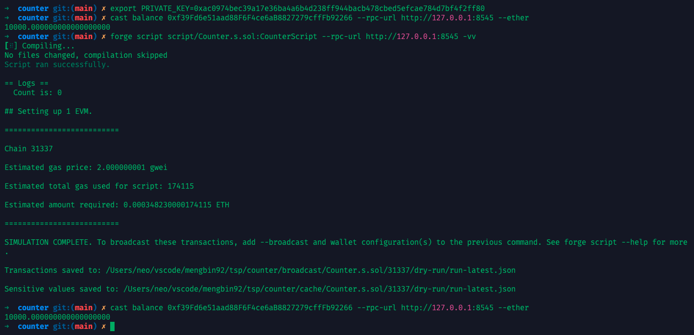
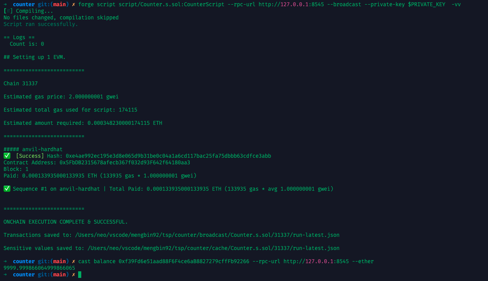

## 合约代码：Counter.sol

我们从一个最基础的合约开始：

```solidity
// SPDX-License-Identifier: MIT
pragma solidity ^0.8.0;

contract Counter {
    uint256 public count;

    function increment() public {
        count += 1;
    }

    function getCount() public view returns (uint256) {
        return count;
    }
}
```

* `count` 是一个状态变量。
* `getCount()` 是一个 view 函数（只读）。
* `increment()` 是一个修改函数（会产生交易）。

---

##  一、Solidity 不是 REST API

| 操作       | REST 等价             | Solidity 中的意义           |
| :--------- | :-------------------- | :-------------------------- |
| 读取数据   | GET /resource         | call 调用 view/pure 函数    |
| 修改数据   | POST /resource/update | sendTransaction (broadcast) |
| 请求者身份 | token / session       | msg.sender                  |
| 状态存储   | DB / memory           | 链上状态 (state)            |

---

## 二、读取 (View)

```solidity
function getCount() public view returns (uint256)
```

* 读取性调用，不需要 Gas
* 不会生成交易，不会上链
* 用于前端展示或本地 call 操作

### Foundry示例:

**Counter.s.sol**：  

```solidity
// SPDX-License-Identifier: MIT
pragma solidity ^0.8.0;

import "forge-std/Script.sol";
import "../src/Counter.sol";

contract CounterScript is Script {
    function run() external {
        // 开始广播，使用本地 anvil 的私钥
        vm.startBroadcast();

        // 部署合约
        Counter counter = new Counter();

        // // 调用 increment()
        // counter.increment();

        // 调用 getCount()
        uint256 count = counter.getCount();

        console.log("Count is:", count); // 打印输出，方便查看

        vm.stopBroadcast();
    }
}
```

**执行:**

```bash
# 配置私钥
$ export PRIVATE_KEY=0xac0974bec39a17e36ba4a6b4d238ff944bacb478cbed5efcae784d7bf4f2ff80
# 查询私钥对应账户的余额
$ cast balance 0xf39Fd6e51aad88F6F4ce6aB8827279cffFb92266 --rpc-url http://127.0.0.1:8545 --ether
10000.000000000000000000
# 执行脚本
$ forge script script/Counter.s.sol --rpc-url http://127.0.0.1:8545 -vv
# 再次查询余额，余额并没有减少
$ cast balance 0xf39Fd6e51aad88F6F4ce6aB8827279cffFb92266 --rpc-url http://127.0.0.1:8545 --ether
10000.000000000000000000
```



---

## 三、修改 (Transaction)

```solidity
function increment() public
```

* 需要 **发起交易** （sendTransaction）
* 需要 **签名** 和 **Gas 费用**
* 会产生新的 block 和 state change

### Foundry示例:

删除上面`Counter.s.sol`中调用`increment()`的注释即可。

配合命令:

```bash
$ forge script script/Counter.s.sol:CounterScript --rpc-url http://127.0.0.1:8545 --broadcast --private-key $PRIVATE_KEY  -vv
# 再次查询余额，因为要发起交易
$ cast balance 0xf39Fd6e51aad88F6F4ce6aB8827279cffFb92266 --rpc-url http://127.0.0.1:8545 --ether
9999.999866064999866065
```



---

## 四、msg.sender 的作用

**`msg.sender` 是什么？**

在 Solidity 中：

> `msg.sender` 是当前调用合约的账户地址或合约地址。

它代表当前 **消息（调用）发送者**，具体取决于调用上下文。

**举个例子**：

* 如果你用钱包或脚本直接调用合约函数，那么：
  * `msg.sender` = 你的钱包地址（或脚本里广播用的地址）
* 如果你通过另一个合约间接调用：
  * `msg.sender` = 调用者合约的地址，而不是原始用户

**常见用途**：

| 场景             | 用法                                         |
| :--------------- | :------------------------------------------- |
| 权限控制         | `require(msg.sender == owner, "Not owner");` |
| 记录谁调用了函数 | `logs.push(msg.sender);`                     |
| 发 token、NFT    | `_mint(msg.sender, 1);`                      |

---

### Foundry示例:

在我们执行的合约中增加一个 `whoAmI()` 函数：

```solidity
function whoAmI() public view returns (address) {
    return msg.sender;
}
```

然后我们在 `Counter.s.sol` 脚本中增加一个新的脚本合约 `WhoAmIScript`:  

```solidity
contract WhoAmIScript is Script {
    function run() external {
        vm.startBroadcast();

        // 部署合约
        Counter counter = new Counter();

        address sender = counter.whoAmI();
        console.log("msg.sender returned by whoAmI():", sender);

        vm.stopBroadcast();
    }
}
```

**执行命令:**

```bash
# 配置私钥
$ export PRIVATE_KEY=0xac0974bec39a17e36ba4a6b4d238ff944bacb478cbed5efcae784d7bf4f2ff80
# 这里我们使用配置的私钥来部署这个合约，所以会收到返回消息 `msg.sender returned by whoAmI(): 0xf39Fd6e51aad88F6F4ce6aB8827279cffFb92266`
$ forge script script/Counter.s.sol:WhoAmIScript --rpc-url http://127.0.0.1:8545 --broadcast --private-key $PRIVATE_KEY  -vv
```


---

## 五、忽隐忽现的 --broadcast --private-key

在上面的操作中，`--broadcast --private-key` 这两个参数时而出现，时而消失，为什么呢？

这是一个非常关键的问题，理解 `--broadcast` 和 `--private-key` 的用途，有助于你区分**交易仿真**和**实际上链**之间的根本区别。

**先说结论**：

| 命令类型                  | 是否需要 `--broadcast` | 是否需要 `--private-key` | 是否发真实交易 | 是否消耗 gas | 用途说明              |
|:--------------------- |:------------------ |:------------------- |:---------------- |:-------- |:------------------------ |
| `forge simulate`（仿真）  | ❌                  | ❌                    | ❌       | ❌        | 只是仿真，不上链         |
| `forge script`（仿真/模拟） | ❌                  | ❌                    | ❌       | ❌        | 只是模拟执行，不发交易       |
| `forge script`（发送交易）  | ✅                  | ✅                    | ✅       | ✅        | 真实发送交易，上链         |
| `cast call`（只读函数）     | ❌                  | ❌                    | ❌       | ❌        | 链下读取 view/pure 函数 |
| `cast send`（写操作）      | ✅                  | ✅                    | ✅       | ✅        | 发送写操作，如 mint、转账等  |


### 举个例子

### 1. 读取操作（只读函数，如 `getCount()` 或 `whoAmI()`）

**不需要发交易**：

```bash
$ forge script script/ViewOnly.s.sol:ViewOnly --rpc-url http://127.0.0.1:8545
```

或者：

```bash
$ cast call 0x... "getCount()" --rpc-url http://127.0.0.1:8545
```

因为这些是 **view 函数调用（不改变状态）**，底层调用的是 `eth_call`，属于 EVM 仿真，不会上链、不计 gas、不需要签名。

### 2. 写操作（改变状态的函数，如 `increment()`）

如果你希望脚本 **真的发送交易**，你必须加入：

* `--broadcast`：明确告诉 Foundry，要发出交易
* `--private-key`：提供签名者（即谁发送交易）

```bash
$ forge script script/CounterScript.s.sol:CounterScript \
  --rpc-url http://127.0.0.1:8545 \
  --private-key $PRIVATE_KEY \
  --broadcast \
  -vv
```

> 如果你不加 `--broadcast`，脚本会“演一下” increment 的逻辑，但不会真的把它写入区块链状态。


### 原理解析

| 参数               | 背后逻辑                                 |
| ---------------- | ------------------------------------ |
| `--broadcast`    | 把模拟的交易真正发出去（eth\_sendRawTransaction） |
| `--private-key`  | 用于签名交易，没有就无法广播                       |
| 不加 `--broadcast` | 默认只仿真交易（用 eth\_call 方式模拟 EVM 执行）     |

### 实际建议

| 情况                | 是否加参数                               |
| :----------------- | :----------------------------------- |
| 你只是测试脚本逻辑、打印数据等   | ❌ 不加 `--broadcast`、不加私钥             |
| 你想部署合约或更改链上状态     | ✅ 加 `--broadcast` 和 `--private-key` |
| 你调用纯 view/pure 函数 | ❌ 直接用 `cast call` 或脚本仿真             |

---

<div align="center">
  
</div>

> 声明：本作品采用[署名-非商业性使用-相同方式共享 4.0 国际 (CC BY-NC-SA 4.0)](https://creativecommons.org/licenses/by-nc-sa/4.0/deed.zh)进行许可，使用时请注明出处。  
> Author: [mengbin](mengbin1992@outlook.com)  
> blog: [mengbin](https://mengbin.top)  
> Github: [mengbin92](https://mengbin92.github.io/)  
> 腾讯云开发者社区：[孟斯特](https://cloud.tencent.com/developer/user/6649301)  
---