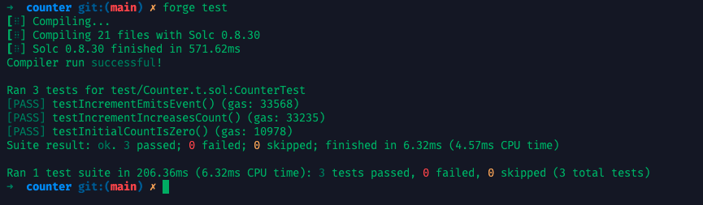
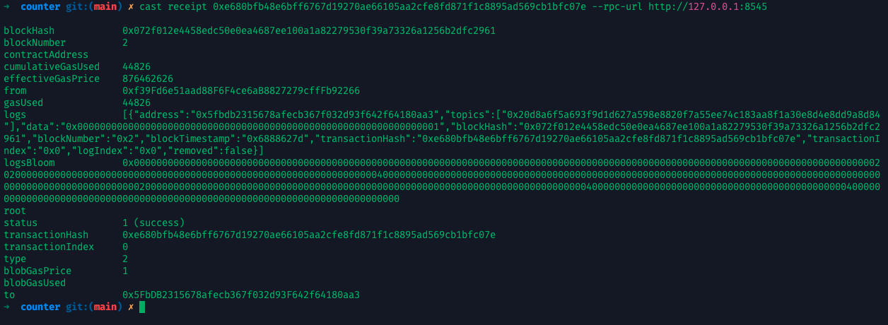

## 一、事件是什么？

在 Solidity 中，**事件（`event`）不是控制台输出，也不是日志记录函数，而是链上广播机制**。

* `event` 是以太坊虚拟机（EVM）内置的 **日志系统**（logs）
* 事件可以在合约执行过程中发出并被监听
* 它们存在于 **交易收据（transaction receipt）** 中，而不是链上状态

```solidity
event Transfer(address indexed from, address indexed to, uint256 amount);
```

## 二、事件的声明与触发

### 示例合约：`EventDemo.sol`

```solidity
// SPDX-License-Identifier: MIT
pragma solidity ^0.8.0;

contract EventDemo {
    event Greeted(address indexed sender, string message);

    function greet(string memory message) public {
        emit Greeted(msg.sender, message);
    }
}
```

---

## 三、事件与 `console.log()` 有何不同？

| 比较项    | `console.log()`（Forge 调试用） | `event`（链上广播）    |
| ------ | -------------------------- | ---------------- |
| 是否上链   | ❌ 否，仅本地运行                  | ✅ 是，写入交易日志       |
| 是否可被监听 | ❌ 否                        | ✅ 是，可被前端/Web3 监听 |
| 运行环境   | 本地、测试时可用                   | 任意 EVM 环境均可使用    |
| 实用场景   | 调试临时输出                     | 广播链上动作供外部使用      |

---

## 四、indexed 的作用：支持按条件过滤

你可以为事件中的参数加上 `indexed`，最多三个，这样它们就会变成 **事件主题（topics）**，可在链上快速筛选。

```solidity
event Transfer(address indexed from, address indexed to, uint256 amount);
```

这使得你可以仅查询某地址的所有 `Transfer` 事件，而不需要扫描全链日志。

---

## 五、测试与监听事件

### 1. Foundry 中测试事件

下面以经典的 `Counter` 合约为例，新增一个事件用于测试：

#### 合约：`Counter.sol`

```solidity
// SPDX-License-Identifier: MIT
pragma solidity ^0.8.0;

contract Counter {
    uint256 public count;

    // 添加事件声明
    event Incremented(uint256 newCount);

    function increment() public {
        count += 1;

        // 触发事件
        emit Incremented(count);
    }

    function getCount() public view returns (uint256) {
        return count;
    }
}
```

#### 测试文件：`test/Counter.t.sol`

```solidity
// SPDX-License-Identifier: MIT
pragma solidity ^0.8.0;

import "forge-std/Test.sol";
import "../src/Counter.sol";

contract CounterTest is Test {
    Counter public counter;

    function setUp() public {
        counter = new Counter();
    }

    function testInitialCountIsZero() public {
        assertEq(counter.getCount(), 0);
    }

    function testIncrementIncreasesCount() public {
        counter.increment();
        assertEq(counter.getCount(), 1);
    }

    // 事件触发测试
    function testIncrementEmitsEvent() public {
        vm.expectEmit(false, false, false, true); // 只验证数据部分（不是 indexed 的 topic）
        emit Counter.Incremented(1);
        counter.increment();
    }
}
```



---

### 2. 脚本中打印日志

**测试文件：`scripts/Counter.s.sol`**：

```solidity
// SPDX-License-Identifier: MIT
pragma solidity ^0.8.0;

import "forge-std/Script.sol";
import "../src/Counter.sol";

contract CounterEmitScript is Script {
    function run() external {
        // 开始广播交易（写入链上）
        vm.startBroadcast();

        // 使用部署后的合约地址
        address counterAddr = address(0xYourDeployedCounterAddress);
        Counter counter = Counter(counterAddr);

        // 发起交易
        counter.increment();

        vm.stopBroadcast();
    }
}
```

这个脚本只是发起交易。**要获取事件日志，我们需要读取交易 receipt，这部分要用外部工具（如 cast 或 ethers.js）处理，因为 Solidity 脚本本身无法访问 receipt。**

我们可以在执行 `forge script` 时，加上 `--json` 选项并从输出中解析出交易哈希，然后用 `cast` 查看交易 receipt 和事件日志，步骤如下：

1. 执行脚本并保存 JSON 输出：

```bash
# 配置私钥
$ export PRIVATE_KEY=0xac0974bec39a17e36ba4a6b4d238ff944bacb478cbed5efcae784d7bf4f2ff80
$ forge script script/Counter.s.sol:CounterEmitScript \
  --rpc-url http://127.0.0.1:8545 \
  --private-key $PRIVATE_KEY \
  --broadcast \
  --json \
  -vv > result.json
```

result.json内容如下：  

```json
{"logs":[],"returns":{},"success":true,"raw_logs":[{"address":"0x5fbdb2315678afecb367f032d93f642f64180aa3","topics":["0x20d8a6f5a693f9d1d627a598e8820f7a55ee74c183aa8f1a30e8d4e8dd9a8d84"],"data":"0x0000000000000000000000000000000000000000000000000000000000000001"}],"traces":[["Deployment",{"arena":[{"parent":null,"children":[],"idx":0,"trace":{"depth":0,"success":true,"caller":"0x1804c8ab1f12e6bbf3894d4083f33e07309d1f38","address":"0x5b73c5498c1e3b4dba84de0f1833c4a029d90519","maybe_precompile":false,"selfdestruct_address":null,"selfdestruct_refund_target":null,"selfdestruct_transferred_value":null,"kind":"CREATE","value":"0x0","data":"0x...","output":"0x...","gas_used":259762,"gas_limit":1073669316,"status":"Return","steps":[],"decoded":{"label":null,"return_data":null,"call_data":null}},"logs":[],"ordering":[]}]}],["Execution",{"arena":[{"parent":null,"children":[1,2,3,4],"idx":0,"trace":{"depth":0,"success":true,"caller":"0xf39fd6e51aad88f6f4ce6ab8827279cfffb92266","address":"0x5b73c5498c1e3b4dba84de0f1833c4a029d90519","maybe_precompile":null,"selfdestruct_address":null,"selfdestruct_refund_target":null,"selfdestruct_transferred_value":null,"kind":"CALL","value":"0x0","data":"0xc0406226","output":"0x","gas_used":173200,"gas_limit":1073720760,"status":"Stop","steps":[],"decoded":{"label":null,"return_data":null,"call_data":null}},"logs":[],"ordering":[{"Call":0},{"Call":1},{"Call":2},{"Call":3}]},{"parent":0,"children":[],"idx":1,"trace":{"depth":1,"success":true,"caller":"0x5b73c5498c1e3b4dba84de0f1833c4a029d90519","address":"0x7109709ecfa91a80626ff3989d68f67f5b1dd12d","maybe_precompile":null,"selfdestruct_address":null,"selfdestruct_refund_target":null,"selfdestruct_transferred_value":null,"kind":"CALL","value":"0x0","data":"0x7fb5297f","output":"0x","gas_used":0,"gas_limit":1056941001,"status":"Return","steps":[],"decoded":{"label":null,"return_data":null,"call_data":null}},"logs":[],"ordering":[]},{"parent":0,"children":[],"idx":2,"trace":{"depth":1,"success":true,"caller":"0x5b73c5498c1e3b4dba84de0f1833c4a029d90519","address":"0x5fbdb2315678afecb367f032d93f642f64180aa3","maybe_precompile":false,"selfdestruct_address":null,"selfdestruct_refund_target":null,"selfdestruct_transferred_value":null,"kind":"CREATE","value":"0x0","data":"0x6...","output":"0x6...","gas_used":113557,"gas_limit":1056909248,"status":"Return","steps":[],"decoded":{"label":null,"return_data":null,"call_data":null}},"logs":[],"ordering":[]},{"parent":0,"children":[],"idx":3,"trace":{"depth":1,"success":true,"caller":"0x5b73c5498c1e3b4dba84de0f1833c4a029d90519","address":"0x5fbdb2315678afecb367f032d93f642f64180aa3","maybe_precompile":null,"selfdestruct_address":null,"selfdestruct_refund_target":null,"selfdestruct_transferred_value":null,"kind":"CALL","value":"0x0","data":"0xd09de08a","output":"0x","gas_used":23762,"gas_limit":1056797138,"status":"Stop","steps":[],"decoded":{"label":null,"return_data":null,"call_data":null}},"logs":[{"raw_log":{"topics":["0x20d8a6f5a693f9d1d627a598e8820f7a55ee74c183aa8f1a30e8d4e8dd9a8d84"],"data":"0x0000000000000000000000000000000000000000000000000000000000000001"},"decoded":{"name":null,"params":null},"position":0}],"ordering":[{"Log":0}]},{"parent":0,"children":[],"idx":4,"trace":{"depth":1,"success":true,"caller":"0x5b73c5498c1e3b4dba84de0f1833c4a029d90519","address":"0x7109709ecfa91a80626ff3989d68f67f5b1dd12d","maybe_precompile":null,"selfdestruct_address":null,"selfdestruct_refund_target":null,"selfdestruct_transferred_value":null,"kind":"CALL","value":"0x0","data":"0x76eadd36","output":"0x","gas_used":0,"gas_limit":1056773421,"status":"Return","steps":[],"decoded":{"label":null,"return_data":null,"call_data":null}},"logs":[],"ordering":[]}]}]],"gas_used":194264,"labeled_addresses":{},"returned":"0x","address":null}
{"chain":31337,"estimated_gas_price":"2.000000001","estimated_total_gas_used":293726,"estimated_amount_required":"0.000587452000293726","token_symbol":"ETH"}
{"chain":"anvil-hardhat","status":"success","tx_hash":"0xe680bfb48e6bff6767d19270ae66105aa2cfe8fd871f1c8895ad569cb1bfc07e","contract_address":null,"block_number":2,"gas_used":44826,"gas_price":876462626}
{"chain":"anvil-hardhat","status":"success","tx_hash":"0x175be95259405d886063011e8f80fddfb53c02fc2f13ac8e68cbab010ae69624","contract_address":"0x5FbDB2315678afecb367f032d93F642f64180aa3","block_number":1,"gas_used":175515,"gas_price":1000000001}
{"status":"success","transactions":"/path/to/counter/broadcast/Counter.s.sol/31337/run-latest.json","sensitive":"/Users/neo/vscode/mengbin92/tsp/counter/cache/Counter.s.sol/31337/run-latest.json"}
```

2. 从 `run-latest.json` 中提取交易哈希（或使用 jq），从之前的 `result.json` 中我们可以知道交易相关的内容都存储在 `run-latest.json` 中，运行如下命令可以获取哈希：

```bash
$ jq -r '.transactions[1].hash' $(pwd)counter/broadcast/Counter.s.sol/31337/run-latest.json
# 我这里显示的是这个
0xe680bfb48e6bff6767d19270ae66105aa2cfe8fd871f1c8895ad569cb1bfc07e
```

> 为什么是 `[1]`？
> 因为在我们的场景里，`[0]` 是部署合约的交易，`[1]` 是 `increment()` 的调用交易。


3. 用 `cast` 获取交易 receipt 和事件日志：

```bash
$ cast receipt 0xe680bfb48e6bff6767d19270ae66105aa2cfe8fd871f1c8895ad569cb1bfc07e --rpc-url http://127.0.0.1:8545
```

输出示例：



接下来我们可以用 `cast` 解码 `data`：

```bash
$ cast decode-event --sig "Incremented(uint256)" 0x0000000000000000000000000000000000000000000000000000000000000001
# 因为我们合约部署后只调用了一次 increment()，所以这里输出是这样的
1
```

> --sig 是 Foundry 的 cast decode-event 命令中用于指定 事件签名（event signature） 的参数，用来告诉 cast 要按照哪个事件的格式去解码日志数据。
> 在我们的例子里，事件的定义为 event Incremented(uint256 newCount)，对应的签名就是 Incremented(uint256)

## 六、小练习建议

1. 为 `Counter.sol` 添加 `event Incremented(uint256 newCount)`
2. 在 `increment()` 中 `emit Incremented(count)`
3. 编写测试验证事件是否被正确触发
4. 编写监听脚本或前端页面响应事件

---

## 下一课预告

第 4 课：Solidity 合约中的错误处理机制（`require`、`revert`、`assert`）和自定义错误。

---

<div align="center">
  
</div>

> 声明：本作品采用[署名-非商业性使用-相同方式共享 4.0 国际 (CC BY-NC-SA 4.0)](https://creativecommons.org/licenses/by-nc-sa/4.0/deed.zh)进行许可，使用时请注明出处。  
> Author: [mengbin](mengbin1992@outlook.com)  
> blog: [mengbin](https://mengbin.top)  
> Github: [mengbin92](https://mengbin92.github.io/)  
> 腾讯云开发者社区：[孟斯特](https://cloud.tencent.com/developer/user/6649301)  
---