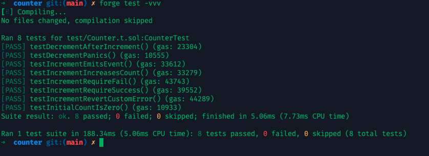

## 一、为什么错误处理如此重要？

区块链是**不可逆**的执行环境，一旦执行逻辑失败或出现异常，状态必须 **完全回滚**，以防止资金损失或系统进入不可恢复状态。Solidity 的错误处理机制允许我们：

* **终止交易执行**
* **返回原因字符串或结构化错误**
* **节省 Gas**（在失败时停止执行）
* **保持系统状态一致性**
* **帮助调试和单元测试**

举例：如果用户尝试从余额为 0 的账户中取款，我们应在逻辑层立即中止执行，而不是继续走到更底层逻辑。

---

## 二、require：外部输入与状态条件的守门人

### 语法

```solidity
require(condition, "Failure message");
```

* 通常用于验证函数输入参数、权限控制、账户余额等外部依赖条件
* 如果 `condition` 为 `false`，自动 **revert**，并附带错误消息

### 场景举例

```solidity
function deposit(uint amount) public {
    require(amount > 0, "Deposit amount must be greater than zero");
    balance[msg.sender] += amount;
}
```

### 实践要点

* **清晰明了的消息**有助于前端显示或调试
* 用于检测 *“可预期的失败”*，例如用户输入非法参数、合约状态不符合操作要求

---

## 三、revert：更灵活的显式失败语句

### 语法

```solidity
if (conditionFails) {
    revert("Reason for failure");
}
```

* 与 `require` 类似，都会 **回滚状态并退还 Gas（未消耗部分）**
* 优势是允许我们先执行多步逻辑或嵌套判断，然后再统一失败处理

### 示例

```solidity
function withdraw(uint amount) public {
    if (amount > balance[msg.sender]) {
        revert("Insufficient balance");
    }
    balance[msg.sender] -= amount;
}
```

### 进阶用法

```solidity
function executeTrade(address user, uint amount) public {
    if (!isWhitelisted(user)) {
        revert("User not whitelisted");
    }
    if (amount < minTradeSize) {
        revert("Trade amount too small");
    }
    // proceed with trade
}
```

---

## 四、assert：防御性编程的最后防线

### 语法

```solidity
assert(condition);
```

* **不返回错误字符串**，失败时触发 `Panic(uint256)` 错误（错误码如 `0x01` 表示断言失败）
* 用于测试**不可变条件、不变量或内部错误**
* **永远不应该被用户输入触发**，否则说明合约存在重大逻辑漏洞

### 示例

```solidity
function increment() public {
    count += 1;
    assert(count > 0); // 这个永远应该成立
}
```

### 常见场景

* 检查数组索引越界
* 验证状态机状态不可能出错
* Solidity 0.8+ 版本中，很多算术溢出已内建 assert-like 检查（除非 `unchecked`）

---

## 五、自定义错误（Custom Errors）

Solidity 0.8.4 起引入了自定义错误机制：

### 语法

```solidity
error NotEnoughBalance(uint256 requested, uint256 available);

function withdraw(uint amount) public {
    if (amount > balance[msg.sender]) {
        revert NotEnoughBalance(amount, balance[msg.sender]);
    }
}
```

### 优点

| 项           | String 失败          | 自定义错误                 |
| :----------- | :------------------- | :------------------------- |
| Gas 成本     | 高（每个字符都编码） | 低（只编码数据）           |
| 可读性       | 好                   | 好                         |
| 可结构化分析 | 不行                 | 可以（可被前端或脚本解析） |

### 多错误例子

```solidity
error Unauthorized(address caller);
error InvalidAmount(uint256 amount);

function transferOwnership(address newOwner) public {
    if (msg.sender != owner) revert Unauthorized(msg.sender);
    if (newOwner == address(0)) revert InvalidAmount(0);
    owner = newOwner;
}
```

---

## 六、使用机制选择指南

| 场景                 | 使用机制           | 推荐理由                           |
| :------------------- | :----------------- | :--------------------------------- |
| 基础参数验证         | `require`          | 简洁明确，附带错误消息             |
| 多条件判断或嵌套逻辑 | `revert`           | 可读性好，适合逻辑封装             |
| 内部程序断言         | `assert`           | 表示不可被破坏的程序性不变量       |
| 节约 Gas + 可调试    | `error` + `revert` | 结构清晰，适合高复杂度和可读性设计 |

---

## 七、实战练习（基于foundry）

**合约我们还是以 `Counter` 为例**，在这次的实验中，我们将使用 `require` 和 `revert` 来对 `count` 进行限制，确保它小于 `10`，以及使用 `assert` 来防止内部状态错误：

```solidity
// SPDX-License-Identifier: MIT
pragma solidity ^0.8.0;

contract Counter {
    uint256 public count;

    // 添加事件
    event Incremented(uint256 newCount);


    function increment() public {
        count += 1;
        
        // 触发事件
        emit Incremented(count);
    }

    function getCount() public view returns (uint256) {
        return count;
    }

    function whoAmI() public view returns (address) {
        return msg.sender;
    }
}
```

### 练习题 1：限制 `count` 不能超过 10

```solidity
function incrementRequire() public {
    require(count < 10, "Counter overflow");
    count += 1;
}
```

---

### 练习题 2：改用 Custom Error

```solidity
error CounterOverflow(uint current);

function incrementRevert() public {
    if (count >= 10) {
        revert CounterOverflow(count);
    }
    count += 1;
}
```

---

### 练习题 3：尝试使用 `assert` 来检测内部异常

```solidity
function decrement() public {
    count -= 1;
    assert(count >= 0); // uint 永远不能 < 0，会 Panic
}
```

> 编译时不会报错，但运行时可能触发 Panic(0x11) 错误。推荐加 `require` 防御性判断替代。

---

### 测试合约  

```solidity
// SPDX-License-Identifier: MIT
pragma solidity ^0.8.0;

import "forge-std/Test.sol";
import "../src/Counter.sol";

contract CounterTest is Test {
    Counter counter;

    function setUp() public {
        counter = new Counter();
    }

    function testInitialCountIsZero() view public {
        uint256 c = counter.getCount();
        assertEq(c, 0);
    }

    function testIncrementIncreasesCount() public {
        counter.increment();
        uint256 c = counter.getCount();
        assertEq(c, 1);
    }

    // 测试事件是否正确触发
    function testIncrementEmitsEvent() public {
        // 设定期望的事件参数（按顺序匹配）
        vm.expectEmit(false, false, false, true); // 只检查数据，不检查 topics（因为 uint256 不能 indexed）
        emit Counter.Incremented(1);

        counter.increment();
    }

        function testIncrementRequireSuccess() public {
        for (uint i = 0; i < 10; i++) {
            counter.incrementRequire();
        }
    }

    function testIncrementRequireFail() public {
        for (uint i = 0; i < 10; i++) {
            counter.incrementRequire();
        }
        vm.expectRevert("Counter overflow");
        counter.incrementRequire();
    }

    function testIncrementRevertCustomError() public {
        for (uint i = 0; i < 10; i++) {
            counter.incrementRevert();
        }
        vm.expectRevert(abi.encodeWithSelector(Counter.CounterOverflow.selector, 10));
        counter.incrementRevert();
    }

    function testDecrementPanics() public {
        vm.expectRevert(); // expect a panic due to underflow
        counter.decrement();
    }

    function testDecrementAfterIncrement() public {
        counter.increment();
        counter.decrement();
        assertEq(counter.getCount(), 0);
    }
}
```



## 最佳实践总结

* **用户可控参数** → 使用 `require`
* **复杂业务分支** → 使用 `revert`
* **永远不应该发生的情况** → 使用 `assert`
* **节省 Gas 且结构清晰** → 使用自定义错误

 ---
 
 <div align="center">
   
 </div>
 
 > 声明：本作品采用[署名-非商业性使用-相同方式共享 4.0 国际 (CC BY-NC-SA 4.0)](https://creativecommons.org/licenses/by-nc-sa/4.0/deed.zh)进行许可，使用时请注明出处。  
 > Author: [mengbin](mengbin1992@outlook.com)  
 > blog: [mengbin](https://mengbin.top)  
 > Github: [mengbin92](https://mengbin92.github.io/)  
 > 腾讯云开发者社区：[孟斯特](https://cloud.tencent.com/developer/user/6649301)  
 ---