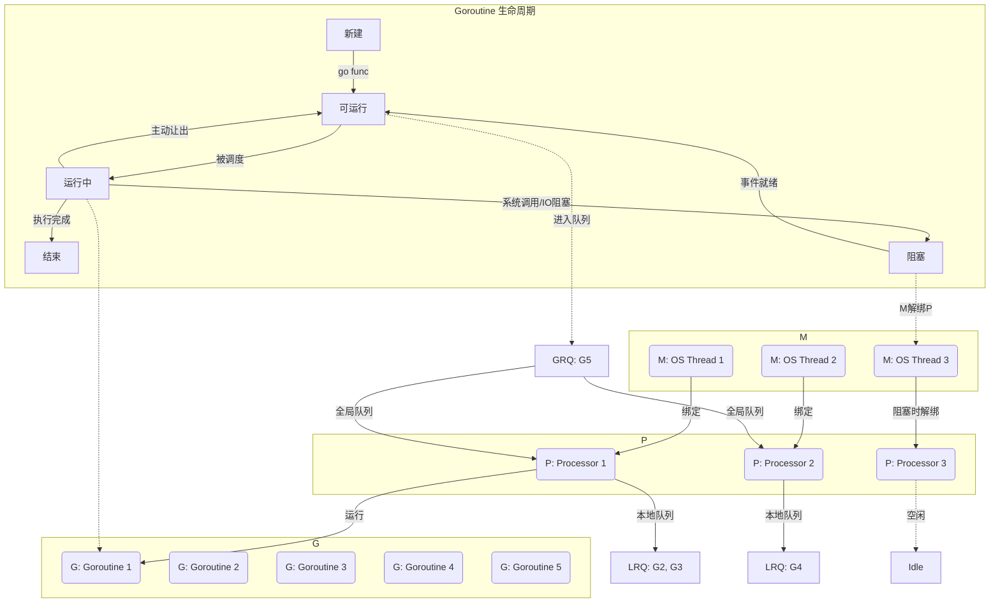

## 1. goroutine 启动过程

在 Go 中，当你写下：

```go
go func() {
    fmt.Println("Hello, goroutine")
}()
```

Go runtime 会经历以下步骤：

1. **创建 goroutine 实例（g 对象）：**runtime 内部用 `g` 结构体表示一个 goroutine，包含：
   * 初始栈（默认 2KB，可按需增长）
   * 寄存器快照
   * 状态（就绪、运行、阻塞、结束）
   * 调度信息（绑定的 P、队列位置等）
2. **放入调度队列：**新 goroutine 会被放进当前 P（Processor，本地调度器）的队列中，等待调度执行。
3. **M-P-G 调度模型：**Go runtime 使用 **M（Machine，OS 线程）-P（Processor）-G（Goroutine）** 调度架构：
   * **M**：操作系统线程
   * **P**：调度上下文，管理本地 G 队列
   * **G**：goroutine 实例

调度器会从队列中取出就绪的 G 绑定到 M 上执行，实现高效的并发。

---

## 2. goroutine 回收机制

Go 并没有提供显式销毁 goroutine 的 API，回收是 **隐式** 进行的。

1. **自然退出：**goroutine 运行的函数返回后，状态变为 "dead"。
2. **释放资源：**
   * 栈内存归还 runtime 内存管理器
   * g 对象可能被放入缓存池以便复用
3. **垃圾回收（GC）清理：**当 dead goroutine 没有任何引用时，会在 GC 中彻底释放内存。

> ⚠️ 如果 goroutine 永远阻塞或被引用，它将无法回收，造成 goroutine leak。



---

## 3. 常见 goroutine 泄漏场景与解决方案

下表总结了实际开发中容易遇到的问题及对应修复方法。

| 场景                     | 问题描述                         | 解决方案                                         |
|:---------------------- |:---------------------------- |:-------------------------------------------- |
| **Channel 阻塞**         | goroutine 永远等不到数据            | 关闭 channel，或使用 `select + time.After` 超时退出    |
| **死循环占用 CPU**          | goroutine 没有退出条件             | 用 `context` 或退出标志控制循环结束                      |
| **主协程提前结束**            | 子 goroutine 尚未执行完，进程直接退出     | 使用 `sync.WaitGroup` 等待所有 goroutine 完成        |
| **Context 泄漏**         | goroutine 一直阻塞在 `ctx.Done()` | 使用 `WithCancel`/`WithTimeout` 并在适当时调用 cancel |
| **大数据持有**              | goroutine 持有大数据引用，函数退出也无法 GC | 避免闭包引用，显式置 `nil`，流式处理数据                      |
| **频繁启动短命 goroutine**   | 频繁创建销毁导致调度开销大                | 使用 worker pool 复用 goroutine                  |
| **第三方库 goroutine 未退出** | 库内部 goroutine 持续运行           | 选生命周期可控的库，或调用 stop/close 方法                  |

---

## 4. 实战优化示例

### 4.1 用 context 控制 goroutine 生命周期

```go
ctx, cancel := context.WithCancel(context.Background())
go func() {
    for {
        select {
        case <-ctx.Done():
            fmt.Println("goroutine exit")
            return
        default:
            // 执行业务逻辑
        }
    }
}()
// 触发退出
cancel()
```

### 4.2 用 WaitGroup 等待 goroutine 完成

```go
var wg sync.WaitGroup
wg.Add(1)
go func() {
    defer wg.Done()
    fmt.Println("task done")
}()
wg.Wait()
```

### 4.3 worker pool 复用 goroutine

```go
jobs := make(chan int, 100)
for w := 0; w < 5; w++ {
    go func(id int) {
        for j := range jobs {
            fmt.Printf("worker %d processing job %d\n", id, j)
        }
    }(w)
}
for i := 0; i < 10; i++ {
    jobs <- i
}
close(jobs)
```

---

## 5. 总结

* **goroutine 是轻量级但不是免费的**，频繁创建和回收会带来调度与内存管理开销。
* Go 的 **goroutine 回收是隐式的**，一旦 goroutine 阻塞或被引用，可能造成内存泄漏。
* 在并发设计中，应明确 goroutine 生命周期，避免失控。
* **context、WaitGroup、worker pool** 是管理 goroutine 生命周期的常用手段。

正确地管理 goroutine，就能在享受 Go 高并发能力的同时，保持系统稳定与高效。

---

<div align="center">
  
</div>

> 声明：本作品采用[署名-非商业性使用-相同方式共享 4.0 国际 (CC BY-NC-SA 4.0)](https://creativecommons.org/licenses/by-nc-sa/4.0/deed.zh)进行许可，使用时请注明出处。  
> Author: [mengbin](mengbin1992@outlook.com)  
> blog: [mengbin](https://mengbin.top)  
> Github: [mengbin92](https://mengbin92.github.io/)  
> 腾讯云开发者社区：[孟斯特](https://cloud.tencent.com/developer/user/6649301)  
---