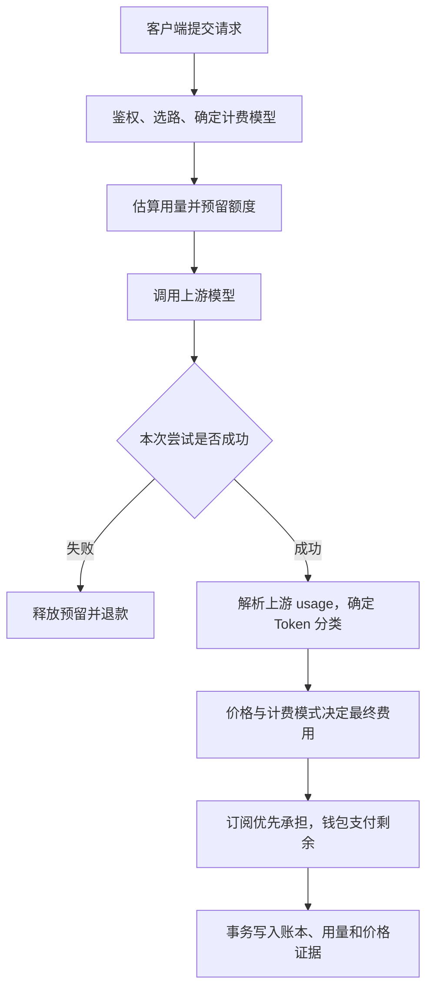

## 摘要

本文从“一次调用为什么产生这笔费用”出发，介绍 Token、价格、缓存、订阅和最终入账之间的关系，适合项目使用者、运营人员和开发者阅读。

> 分析基准：2026-09-08，本地代码提交 `7fce275`。本文描述代码支持的行为及默认值，没有读取生产数据库或核验线上开关。算例价格均为教学假设，不代表任何厂商的实际报价。范围是本项目的 Token 计费链路，不将其泛化为所有图片、音频或工具调用产品的计价规则。

---

## 1. 一次调用的费用从哪里来

在本项目中，一次模型调用的费用主要由四件事决定：

1. **用了多少**：输入、输出、缓存读取和缓存写入分别有多少 Token。
2. **按什么价格**：计费模型对应的单价，以及用户分组倍率。
3. **哪些费用实际收取**：缓存写入收费开关、用量语义灰度模式。
4. **从哪里支付**：先由有效订阅套餐承担，剩余部分由钱包支付。

Token 是模型处理文本的计量单位，不等于字符数、汉字数或单词数。系统提示词、历史对话、工具结果等内容，只要进入本次请求的输入，就会影响本次输入用量；多轮对话不能只计算最后一条用户消息。

本项目不是简单地用“总 Token × 一个价格”结算。输入和输出可以采用不同单价，缓存还会影响输入内部的分类。



主要入口：网关计费调用 `internal/server/http_billing.go`、计费业务实现 `app/billing/internal/biz/billing.go`。

## 2. 先分清 Token 数量与金额单位

### 2.1 五类互斥的计费用量

规范化后的用量称为 `CanonicalBuckets`。互斥意味着同一个 Token 不应同时放进普通输入和缓存输入中重复收费。

| 类别 | 代码字段 | 含义 |
|---|---|---|
| 普通输入 | `UncachedInputTokens` | 未归入缓存读取或写入的输入 |
| 输出 | `OutputTokens` | 模型生成的输出 |
| 缓存读取 | `CacheReadTokens` | 命中已有缓存的输入 |
| 短期缓存写入 | `CacheCreation5mTokens` | 归入 5 分钟缓存写入档的输入 |
| 长期缓存写入 | `CacheCreation1hTokens` | 归入 1 小时缓存写入档的输入 |

五类相加得到 `BillableTotalTokens`。这里的 “Billable” 是规范化统计口径，不保证每一类都实际收费：某类可能免费、未定价或仍处于观察模式。

代码依据：网关用量契约 `internal/biz/usage.go`、计费用量契约 `app/billing/internal/biz/usage_semantics.go`。

### 2.2 钱包使用万分之一美元

`AmountScale = 10000`，因此：

```text
1 USD = 10000 个金额单位
1 个金额单位 = 0.0001 USD
展示金额（USD）= 内部整数金额 / 10000
```

`AmountPerUnit` / `QuotaPerUnit` 仍有兼容读取代码，但当前钱包换算和单价计算使用固定 `AmountScale`，不能据此推断运行时可以任意改变金额尺度。

## 3. 价格如何配置，怎样计算

### 3.1 优先使用模型单价

`system_options` 中的 `ModelPrice` 保存用户侧模型单价，`GroupRatio` 保存用户分组倍率。后端单价单位是 **USD / Token**；管理页面以每百万 Token 展示和编辑，并负责换算。

例如展示为 `3 USD / 百万输入 Token`，后端保存的 `input_price` 应为 `0.000003`，不能直接保存 `3`。

| 配置 | 用途 |
|---|---|
| `ModelPrice` | 用户侧输入、输出、缓存读取、两档缓存写入单价 |
| `GroupRatio` | 用户分组价格倍率 |
| `ModelRatio` | 没有模型单价时使用的模型倍率 |
| `CompletionRatio` | 倍率计费路径中的输出相对输入倍率 |
| `UpstreamModelPrice` | 平台侧上游成本单价，与用户售价分开 |

动态配置成功读取后，以非空配置映射覆盖构造时配置；读取失败则回退到构造时配置。因此排查价格应核对有效配置，不能只看配置文件。

代码依据：价格配置读取 `app/billing/internal/data/pricing_config_repo.go`、价格管理页面 `web/src/pages/admin/PricingPage.tsx`、`BillingUsecase.pricingConfig`。

### 3.2 五桶单价公式

设每类 Token 数为 `Ti`、每 Token 单价为 `Pi`、用户分组倍率为 `G`，完整五桶计价为：

```text
每桶金额单位 = Round(Ti × Pi × G × 10000)
完整费用单位 = 各桶金额单位之和
完整费用 USD = 完整费用单位 / 10000
```

实现是**每桶分别四舍五入，再用整数相加**，不是先把浮点费用全部加完再舍入。实际结算还会应用收费开关；最终费用小于等于 0 时，成功请求的结算入口将其提升为 **1 个金额单位，即 0.0001 USD**。因此极小请求、全零用量或免费桶也不能直接推断为零账单。

缓存价格的缺省规则不同：

- 缓存读取单价未配置：回退为普通输入单价；显式配置为 `0` 则该桶免费。
- 缓存写入单价未配置：对应桶不收费并标记未定价，不回退为输入单价。
- 两档写入价格独立：只配了 5 分钟价格时，5 分钟桶仍可收费，1 小时桶不收费。

代码依据：`calculateCanonicalCost`、`roundScaled`、`finalUserCost`、`commitQuotaDualTrack`。

### 3.3 未配置模型单价时，走倍率公式

```text
费用单位 = Ceil(
    (输入 Token + 输出 Token × CompletionRatio)
    × ModelRatio × GroupRatio
)
费用 USD = 费用单位 / 10000
```

该公式直接产生内部金额单位，不要再额外乘 `10000`。规范桶路径把普通输入和缓存读取合并为输入，缓存写入不计价，直至配置明确的 `ModelPrice`。已有模型单价时，也不会再叠乘 `ModelRatio` 和 `CompletionRatio`。

代码提供的默认用户组倍率为 `default=1`、`vip=0.5`、`svip=0.3`；实际配置可以覆盖。未命中的组或模型倍率回退为 `1`。

例如输入 1000、输出 500，输出倍率 2、模型倍率 0.1、组倍率 1，费用为 `Ceil((1000+500×2)×0.1)=200` 单位，即 `0.02 USD`。

代码依据：`calculateCostWithUsage`、`resolveRatioUserCost`、`calculateRatioCost`。

## 4. 完整算例：一次调用多少钱

假设使用模型单价，已采用可信规范用量，组倍率为 1，缓存写入收费已开启：

| 用量类别 | Token 数 | 假设价格（USD / 百万 Token） | 费用（USD） |
|---|---:|---:|---:|
| 普通输入 | 10000 | 3 | 0.0300 |
| 输出 | 2000 | 15 | 0.0300 |
| 缓存读取 | 20000 | 0.3 | 0.0060 |
| 5 分钟缓存写入 | 4000 | 3.75 | 0.0150 |
| 1 小时缓存写入 | 1000 | 6 | 0.0060 |
| 合计 | 37000 | — | **0.0870** |

对应整数金额为 `300 + 300 + 60 + 150 + 60 = 870`。

如果用户组倍率为 `0.5`，本例各桶舍入后总计为 `435` 单位，即 `0.0435 USD`。

如果缓存写入处于 `observe`，且使用相同桶口径，则实际收费仅为前三项：`0.0660 USD`；缓存写入的 `0.0210 USD` 是影子费用，用于观察和对账。不能把影子费用再次加到用户实扣上。

## 5. 为什么 usage 不能直接相加

不同协议的输入字段可能有不同含义：缓存可能是输入总数的子集，也可能独立于普通输入报告。项目以实际协议、字段形状和解析结果判断，不能只根据模型名称猜测。

假设上游报告输入 10000、缓存读取 8000、输出 1000：

- 如果缓存是输入的子集：普通输入应为 `10000−8000=2000`，规范总量为 `11000`。
- 如果输入不包含缓存：普通输入仍为 `10000`，规范总量为 `19000`。

将第二种口径当成第一种会少收；将第一种当成第二种会重复收费。

项目通过 `UsageEnvelope` 保留原始报告、规范桶、协议和解析状态：

| 状态 | 含义与处理 |
|---|---|
| `verified` | 有可信语义，允许按规范桶计算 |
| `estimated` | 缺少上游 usage，使用估算；不伪造缓存用量 |
| `ambiguous` | 语义不明确，计算两种候选费用并保留审计证据 |
| `legacy` | 旧版生产者，继续旧口径并标明原因 |

对于歧义用量，除紧急 `legacy` 模式外，用户侧取两种候选费用中较低者；V1 请求缺少或携带无效 envelope 也进入歧义处理，不静默信任旧字段。上游成本不会直接复用用户侧较低候选值。

当前有两条独立开关：

| 开关 | 代码默认值 | 控制内容 |
|---|---|---|
| `RELAY_CANONICAL_USAGE_PRODUCER` | 关闭 | 网关是否发送 V1 用量契约 |
| `BILLING_CANONICAL_USAGE_MODE` | `observe` | 使用旧口径收费并观察规范口径，或切换为 `charge` |
| `BILLING_CANONICAL_USAGE_CHARGE_ALLOWLIST` | 空 | `charge` 仅对匹配的订阅账号 ID 与上游模型生效；显式 `*` 才全局生效 |
| `BILLING_CACHE_CREATION_MODE` | `observe` | 缓存写入仅观察，还是按已配置价格实际收费 |

“两条”分别指用量语义切换和缓存写入收费；前者还有生产者和允许列表配套条件。仅设置 `BILLING_CANONICAL_USAGE_MODE=charge`，允许列表为空时仍退回观察模式。真实旧版契约即使在 charge 模式下也保持旧口径。

代码依据：`resolveUserCost`、`ambiguousUserCost`、`CanonicalUsageModeFor`，以及网关 V1 开关 `internal/server/http_billing.go`。

## 6. 预扣、结算和退款如何配合

### 请求前：预留估算金额

`ReserveQuota` 根据估算 Token 计算金额、创建预留记录并占用资金或订阅容量。记录默认 5 分钟后过期，后续由清理机制释放过期预留。

Chat 请求的简易估算使用消息内容的 `len/4`，加上 `max_completion_tokens`、`max_tokens` 或默认 1000 输出 Token；其中 Go 的字符串 `len` 是字节数，并非 Unicode 字符数。原始请求的另一条估算路径使用请求体字节数除以 4（至少 1），再加 100 输出 Token。这些都是粗估，不是精确 tokenizer。

预留时将估算总量作为输入侧参数计算，因此它也不是对最终输入/输出分价账单的精确预测。

### 请求后：成功按实际费用多退少补

取得上游 usage 后重新计算最终费用。预留大于实收时退差额，小于实收时补扣。成功请求会解除冻结并写入消费账本；失败尝试走释放路径，不写成功消费统计。

流式响应同样需要结算，不能按收到多少 SSE 片段收费。网关有响应后的独立、限时计费上下文，避免客户端断开直接取消结算。但不能据此承诺所有中断场景都免费或都收费，具体取决于调用链的成功判定和已获得的用量。

启用异步计费时，接口先返回“已入队”，暂时的 `committed_amount=0` 不表示免费，最终金额以 worker 完成后的账本为准。

代码依据：估算函数 `internal/server/http_helpers.go`、原始请求估算 `internal/server/http_raw_helpers.go`、异步结算 `app/billing/internal/biz/async_billing.go`。

## 7. 订阅与钱包怎样共同支付

要区分两个“订阅”：**用户购买的平台订阅套餐**决定谁承担用户费用；**平台用于转发的上游订阅账号**属于模型来源和上游资源治理。二者不是同一账户。

有有效用户订阅且依赖已接入时，项目优先让套餐承担费用，不足部分由钱包支付。套餐同时检查日、周、月窗口，受最紧的窗口约束，并减去并发请求已经预留的容量。

```text
每个窗口剩余额度 = 上限 − 已用额度 − 已冻结额度
可承担费用 USD = 最小窗口剩余额度 / RateMultiplier
订阅承担 = min(本次费用, 可承担费用)
钱包支付 = 本次费用 − 订阅承担
```

未设置上限的窗口不形成限制。`RateMultiplier` 用于套餐额度记账，订阅实际承担 `X USD` 时窗口记录约 `X × RateMultiplier`；它不同于前面的用户售价 `GroupRatio`。

延续 `0.0870 USD` 算例：若套餐最紧窗口剩余记账额度 `0.10 USD`，`RateMultiplier=2`，且无其他冻结，那么套餐可承担 `0.05 USD`，钱包支付 `0.037 USD`，窗口增加 `0.10 USD`。金额转换时还会应用项目的取整规则，防止套餐超额承担。

提交时在锁内重新计算容量，预留时的分摊不是最终结果。允许透支的配置与用户限制决定钱包补扣能否进入负数；发生新增透支且应收仓库已接入时，会记录相应应收。

代码依据：套餐容量计算 `domain/subscription/biz/subscription_absorbable.go`、套餐用量记账 `domain/subscription/biz/subscription_usecase.go`、`commitSubscriptionAbsorbUSD`、`commitQuotaDualTrack`。

## 8. 用户费用不等于平台成本

用户费用读取 `ModelPrice`，上游成本读取 `UpstreamModelPrice`。成本计算不乘用户组折扣，而使用倍率 `1`。

成本价格优先使用稳定来源键：

```text
channel:<渠道ID>:<上游模型ID>
subscription:<上游订阅账号ID>:<上游模型ID>
```

未命中时兼容查找旧的 `<渠道ID>:<模型>`，最后查裸模型键。调用链已提供正数 `UpstreamCost` 时直接采用该值；没有成本价格则返回 0，并通过审计状态表达缺失，不能把 0 当作厂商免费。

上游成本包含已定价的缓存写入，即使用户侧仍处于缓存观察模式。对可信 V1 用量使用规范桶，其他情况保留旧口径估算；歧义状态必须结合审计字段判断可靠性。

例如用户计费 `0.087 USD`、上游成本 `0.05 USD`，代码毛利指标差额为 `0.037 USD`。这只是请求级计费金额与成本的差额；套餐承担部分并非本次新增现金收入，不能直接当作完整财务利润。

此外，客户端模型别名不一定是计价键。`BILLING_MODEL_SOURCE` 默认使用最终上游模型，`requested` 使用客户端请求模型；当前 `channel_mapped` 在现有调用链中通常等价于 `upstream`。

代码依据：`calculateUpstreamCostWithUsage`、`upstreamCostAuditStatus`、计费模型选择 `internal/biz/billing_model.go`。

## 9. 如何确保重试不重复扣费，如何核对账单

生产提交通过统一事务路径完成状态变更、钱包结算、订阅用量和账本写入；状态条件更新、预留请求唯一约束及账本去重键共同保护重试。无数据库的旧提交函数主要是内存测试兼容路径，不应作为生产原子性的判断依据。

同一请求可能拆成订阅与钱包两行账本。上游成本只归属一行，避免成本重复记账；统计请求数和用量时也应使用项目的聚合去重口径，不能简单把行数当调用次数。

账单排查建议按以下顺序核对：

1. 找到 `request_id` / `reservation_id`，确认状态是已提交、已释放还是异步处理中。
2. 核对计费模型、实际上游模型、用户组和价格配置。
3. 核对原始 usage、五类桶、契约版本和解析状态，尤其检查缓存是否重复包含。
4. 核对用量语义模式、允许列表及缓存收费模式。
5. 按每桶取整公式复算，再核对套餐与钱包分摊。
6. 单独核对上游成本和 `CostAuditStatus`，不要混入用户扣费公式。

账本保存分桶费用、影子费用、语义判断原因和候选费用等信息。接入价格快照仓库后，模型单价路径还保存 `PricingConfigHash`，关联当次生效的分桶单价、组倍率和缓存模式。价格在提交时读取并记录，因此不能用今天的价格直接重算历史账单，也不能假定预留时就锁定了最终价格。

代码依据：价格快照 `app/billing/internal/biz/pricing_snapshot.go`、快照存储 `app/billing/internal/data/pricing_snapshot_repo.go`、账本模型 `app/billing/internal/biz/ledger.go`。

## 10. 继续阅读代码

| 阅读目标 | 文件与重点 |
|---|---|
| RPC 输入和返回金额 | `billing.proto` |
| DTO 转换与同步/异步分发 | `service/billing.go` |
| 预留、算价、分摊、提交、释放 | `biz/billing.go` |
| 验证缓存计价规则 | `cache_creation_cost_test.go` |
| 验证语义模式与歧义结算 | `usage_semantics_cost_test.go` |
| 验证价格证据 | `pricing_snapshot_test.go` |
| 了解协议语义修复背景 | `token-usage-billing-semantics-remediation-2026-08-31.md` |

阅读时以可执行函数和测试为准：历史注释、字段名和旧设计文档可能保留上一阶段的术语，尤其不能把“支持 charge”理解为“线上已开启 charge”。
