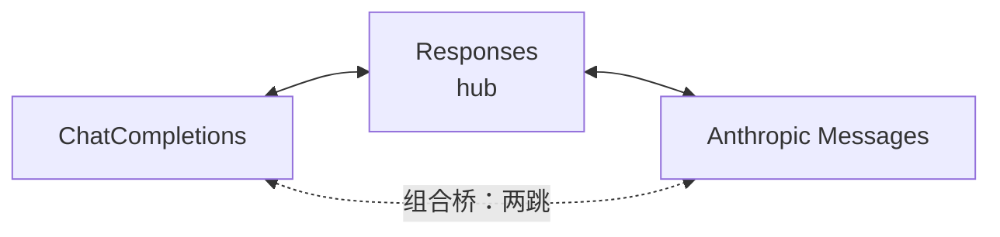
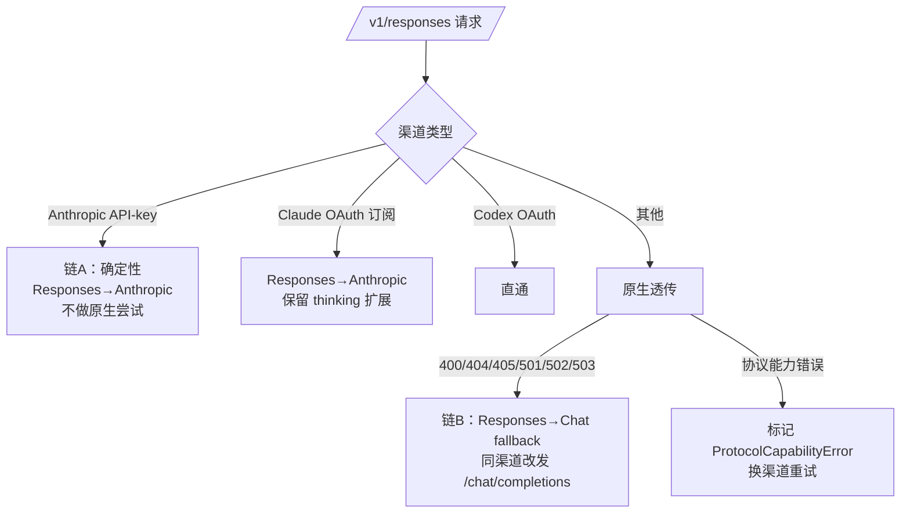

## 摘要

micro-one-api 是一个 LLM API 网关，对外同时暴露 OpenAI ChatCompletions（`/v1/chat/completions`）、OpenAI Responses（`/v1/responses`）和 Anthropic Messages（`/v1/messages`）三个端点，对内要对接二十多家协议各异的上游渠道。客户端协议和上游协议任意组合，协议转换就成了网关的核心能力。

本文以项目真实代码（转换层 `internal/apicompat`，约 4500 行 Go）为例，讲清楚三件事：三种协议的本质差异、为什么用 Responses 做转换 hub、以及流式转换和防御性规范化这些"教科书不教但生产必需"的细节。

> 分析基准：2026-09-10，develop 分支。文中所有 `file:line` 均可直接跳转核对。

---

## 1. 三种协议差在哪

转换之前，先看清楚三者的会话模型差异——所有转换逻辑都是在弥补这些结构性不同：

| 协议 | 会话模型 | 工具调用载体 | 思考能力 |
|---|---|---|---|
| **ChatCompletions**（OpenAI 经典） | `messages[]` 平面数组，role 驱动 | assistant 消息的 `tool_calls[]` + `role=tool` 回复 | `reasoning_effort` 参数 / `reasoning_content` 字段 |
| **Responses**（OpenAI 新一代） | `instructions` + `input[]`，**item 化**：message / function_call / function_call_output / reasoning 都是独立 item | `function_call` / `function_call_output` 独立 item | `reasoning: {effort}`，reasoning 是独立 output item |
| **Anthropic Messages** | `system`（顶层字段）+ `messages[]`（user/assistant 严格交替），content 为 **block 数组** | `tool_use` block（assistant）/ `tool_result` block（user） | `thinking: {budget_tokens}`，thinking 是独立 content block |

三个最关键的结构差异：

1. **工具调用的组织方式**：Chat 把 N 个工具调用塞进一条 assistant 消息的数组里；Responses 把每个调用拆成独立 item；Anthropic 把调用变成 content block 且要求 `tool_use`/`tool_result` 严格配对、跨消息呼应。
2. **系统提示的位置**：Chat 是 `role=system` 消息，Responses 是顶层 `instructions`，Anthropic 是顶层 `system`。
3. **思考过程**：Chat 是一个字符串字段，Responses 是一个 output item，Anthropic 是一个带预算的 content block。

项目里没有设计统一的中间表示（IR），而是三套 DTO（`internal/apicompat/types.go`）加一组命名即方向的点对点转换函数，如 `ResponsesToAnthropicRequest`、`AnthropicToResponsesResponse`。

## 2. 为什么 hub 是 Responses

三个协议全互联需要 6 组转换器。项目实际只维护了 4 组核心转换器加 2 个组合桥，因为拓扑是 **hub-and-spoke，hub 是 Responses**：



最典型的例子：Anthropic 请求转 Chat 请求**不是独立实现**，而是经 Responses 组合两跳：

```go
// internal/apicompat/anthropic_chat_bridge.go:18
responsesReq, err := AnthropicToResponses(req)                 // 第一跳
chatReq, err := ResponsesToChatCompletionsRequest(responsesReq) // 第二跳
```

之后再补回 Responses 表达不了、但 Anthropic 客户端关心的字段：`max_tokens`（并清掉 `max_completion_tokens`，因为 DeepSeek 系端点可能拒绝后者）、`stop_sequences → stop`、流式强制 `stream_options.include_usage=true`。

同样，Claude OAuth 渠道收到 Chat 入站时走 `Chat → Responses → Anthropic` 两跳（`claude_oauth.go:86-104`，注释原文 "via the Responses hub"）。选 Responses 做 hub 的原因很实际：它出现得最晚、表达能力最强（item 化模型能无损容纳另外两者的大部分概念），且 Codex 生态本身就是 Responses 原生。这样新增第 4 个协议（如 Gemini）只需实现它到 hub 的两条边。

## 3. 什么时候触发哪条转换

转换不是无差别发生的。入口 handler 先经 `RelayUsecase.Plan()` 选出渠道，再按渠道类型分派：



两条降级链的设计哲学不同（`internal/server/responses_fallback.go`）：

- **链 A 是确定性的**（:756）：渠道类型是 Anthropic API-key 就一定能判定它不支持 Responses，在原生尝试之前直接转换，省一次注定失败的请求。转换后还要剥离 `Thinking`/`OutputConfig`、清空 server-tool Type、补空 `input_schema`——第三方 Anthropic 兼容端点不支持这些扩展。
- **链 B 是错误触发的**（:29-50）：端点能力无法预先知道，靠状态码判定后向同一渠道改发 `/chat/completions`，流式场景用一个专门的状态机把 Chat SSE chunk 转成 Responses 事件序列。

## 4. 请求转换：一次"拆消息"的过程

以 Chat → Responses 为例（`chatcompletions_to_responses.go:20`），最核心的映射是把 Chat 的"一条 assistant 消息携带 tool_calls 数组"**拆开**：

| Chat 消息 | Responses item |
|---|---|
| `system` | `{role: "system", content}` |
| `user`（多模态） | `text` → `input_text`；`image_url` → `input_image` |
| `assistant` 纯文本 | `{role: "assistant", content: [output_text]}` |
| `assistant` + `tool_calls[]` | **1 条 assistant 消息 + N 个独立 `function_call` item** |
| `role=tool` | `{type: "function_call_output", call_id, output}` |

```go
// chatcompletions_to_responses.go:187 —— 每个 tool_call 变成一个独立 item
items = append(items, ResponsesInputItem{
    Type:      "function_call",
    CallID:    tc.ID,
    Name:      tc.Function.Name,
    Arguments: args, // 空时补 "{}"
})
```

反方向 Responses → Anthropic（`responses_to_anthropic_request.go:14`）则是"拼装"：`instructions` 和 system/developer 项并入顶层 `system`（`\n\n` 拼接），`function_call` → assistant 的 `tool_use` block，`function_call_output` → user 的 `tool_result` block。

这里有一段整个转换层最核心的防御性逻辑——**tool_use/tool_result 配对修复**（`normalizeAnthropicToolPairing` :267-347）。动机是：Codex（store:false）每轮重发全量历史，且常在 function_call 与其 output 之间插入 developer 审批通知等条目，朴素逐条转换必然破坏 Anthropic 的三条不变式：

1. 每个 `tool_result` 必须紧跟含对应 `tool_use` 的 assistant 消息；
2. 每个 `tool_use` 必须被下一条 user 消息中的 `tool_result` 应答（未应答上游直接 400）；
3. user/assistant 必须交替。

算法先按 `tool_use_id` 索引所有 tool_result，重组时 assistant 只保留有应答的 tool_use，孤立调用整体删除，孤儿 result 丢弃，前后各跑一遍同角色消息合并。这类代码不创造任何"功能"，但没有它，真实客户端的历史消息在真实上游面前就是一堆 400。

## 5. 流式转换：两种事件模型的对译

流式是最难的部分，因为两边的流事件粒度完全不同：

- **Anthropic**：`message_start → content_block_start → delta* → content_block_stop → message_delta → message_stop`，按**顺序 block index** 引用；
- **Responses**：`response.created → output_item.added → content_part.added → *.delta* → *.done → output_item.done → response.completed`，按 **output_index + item_id** 引用。

以 Anthropic 流 → Responses 流为例（`anthropic_to_responses_response.go:214`）：

| Anthropic 事件 | Responses 事件 |
|---|---|
| `message_start` | `response.created`（in_progress 骨架） |
| `content_block_start` thinking | `output_item.added`(reasoning) + `reasoning_summary_part.added` |
| `content_block_start` tool_use | `output_item.added`(function_call, in_progress) |
| `text_delta` / `thinking_delta` / `input_json_delta` | `output_text.delta` / `reasoning_summary_text.delta` / `function_call_arguments.delta` |
| `signature_delta` | **丢弃**（无等价物） |
| `content_block_stop` | 对应 `*.done` + `output_item.done` |
| `message_stop` | `response.completed`（含最终 usage） |

反方向有三个教科书不会告诉你的难点：

**其一，索引体系翻译。** Responses 事件按 output_index 引用 item，Anthropic 按顺序 block index，状态机里有一张 `OutputIndexToBlockIdx` 映射表（`responses_to_anthropic.go:194`）负责翻译。Chat 流更特殊：tool_call 用客户端维度的整数 `index`，乱序或孤儿分片直接丢弃，防止产生非法 chunk。

**其二，交错 delta 的缓冲重排。** Chat 系上游会交错发送并行工具调用的参数分片，而 Anthropic 要求 content block 严格有序生命周期。缓冲模式（`NewBufferedResponsesEventToAnthropicState` :226）把参数累积起来，完成时按 output_index 排序后整段发出 start+delta+stop。

**其三，done 事件一个都不能少。** Chat → Responses 方向，终止时 `FinalizeChatCompletionsResponsesStream`（`chatcompletions_responses_bridge.go:792`）要补发全部 done 事件——代码注释明确写着：不做这步，Codex 会话会卡死。reasoning delta 到达前必须先开 reasoning item，否则 Codex 客户端直接丢弃增量。每条流路径还配一个幂等的 `Finalize*` 函数，上游断流时合成终止事件，usage 取状态机已累计值。

还有一个隐蔽的坑：**字段存在性**。Go 的 `omitempty` 会丢掉 `output_index: 0`、空 `content: []`、空 `arguments: ""` 这些零值字段，而 Codex CLI 这类严格客户端拒绝缺字段的事件。项目在 wire 层用显式的 `MarshalJSON`（`responses_stream_event_wire.go:24`）对每种事件类型强制保留这些字段，作为两条转换链共用的"字段存在性唯一事实源"。

## 6. 那些必须知道的细节

**reasoning effort ↔ thinking budget 的换算。** Responses 用档位（low/medium/high），Anthropic 用 token 预算。映射是 low→1024、medium→4096、high→10240、xhigh→32768，外加两道钳制：budget ≤ max_tokens/2（给可见回答留空间，同时满足 Anthropic `budget_tokens < max_tokens` 约束）、budget ≥ 1024（Anthropic 最低要求）。

**usage 口径的双向不漂移。** Anthropic 是互斥桶（input_tokens 不含缓存），OpenAI 是包容桶（input_tokens 含缓存）。两个方向的换算统一走 `pkg/usage` 的正投影 `ProjectOpenAI` 和逆投影 `SplitInclusive`，保证缓存 token 口径不漂移——这直接影响计费正确性。

**web_search 的对称特殊处理。** Anthropic 上游返回的 `server_tool_use`/`web_search_tool_result` 块在两个方向都被丢弃（无等价物）；而 Responses → Anthropic 方向会反向**合成**这两个块，让 Claude Code 能计数搜索次数。历史消息里的 `web_search_call` item 也要丢弃——否则 Kimi K3 等透传型上游会累积 "Search results for query:" 文本造成死循环。

**metadata 不能丢。** `AnthropicRequest.Metadata` 必须原样透传：OAuth/Claude-Code 路径依赖 `metadata.user_id` 参与上游"是否官方 Claude Code 请求"的判定，丢了这个字段请求会被归类为第三方 app（`types.go:28-33` 有专门的长注释）。

**schema 兜底。** 双向都把工具的 parameters/input_schema 兜底为 `{"type":"object","properties":{}}`——OpenAI 端缺 `properties` 报错，Anthropic 兼容端点拒绝 null schema（422）。

## 7. 设计经验小结

1. **hub-and-spoke 优于全互联**：N 个协议全互联是 N×(N-1) 组转换器；选一个表达力最强的协议做 hub 后只剩 2×(N-1)，新增协议只需接到 hub。
2. **非流式用纯函数，流式用显式状态机**：item 生命周期、index 映射、参数聚合全部收敛到 State 结构体，配幂等的断流兜底。
3. **防御性规范化是生产必需品**：配对修复、空参数补 `"{}"`、空输出补 `"(empty)"`、schema 兜底——每一条背后都是某个真实上游的 400/422。
4. **字段存在性 ≠ 字段值**：严格客户端要求零值字段也必须出现，序列化框架的默认省略语义会成为 bug 源。
5. **降级链分两类**：渠道类型可判定的在原生尝试前转换（省一次失败请求），不可判定的靠状态码触发 fallback，并配合"协议能力错误"让重试漂移到原生支持的渠道。

---

协议转换看起来是"体力活"，真正做起来会发现它逼近一个编译器后端：三种 IR 之间的指令选择、寄存器分配（index 映射）和异常恢复（断流兜底）一个都不少。完整版文档（含全部转换函数签名与行号索引）在仓库 `docs/design/protocol-conversion.md`，欢迎对照源码阅读。
