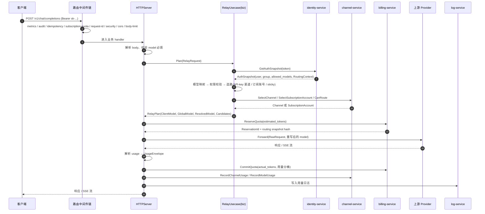

## 摘要

从一次我自己撞的墙讲起：网关把上游的 4xx 改写成了 502，而终止分支缺日志，我完全看不到发生了什么。顺着这个坑，我把 `/v1/chat/completions` 这条链路从头到尾捋了一遍，这篇记录其中的选择——哪些是当初顺手写下的、哪些是返工回来的、哪些我到现在也还没底。

---

## 0. 先讲一次我自己撞的墙

项目还没正式上线，所以下面讲的都是开发阶段的事：没有真实流量，也没有生产事故，有的是我自己在测试和自建验收里一次次撞出来的问题。

前一阵子我在测 `/v1/responses`，它开始稳定地返回 502。

第一反应是上游炸了，于是按顺序排查了一遍：容器状态正常，渠道测试通过，凭据能刷新，上游地址能通，把模型单独拎出来打也是好的。全都正常，但请求就是 502。

真正让我难受的不是这个 502，而是**我看不到它是什么**。终止分支上缺一行日志，于是上游到底返回了什么、是我的问题还是调用方的问题，完全不可见。最后定位到：上游其实老老实实返回了一个 4xx，是网关把它改写成了 502。

那天之后我把这条链路从头到尾捋了一遍，才发现有太多"当初顺手写下的选择"，单个看都很合理，但它们合在一起决定了：出事的时候我能不能查到、钱会不会算错、客户端断开时会不会白送一次响应。

这篇就聊这些选择。不聊设计原则，聊我当时具体卡在哪、试了什么、最后为什么这么定、以及哪些地方我到现在也还没底。

---

## 1. 先把这条链路摊开

一个 Chat Completions 请求进来，到用户收到响应、账上扣掉钱，大概是这么走的：



落到文件上大概是这样几块：

| 环节 | 文件 | 备注 |
|------|------|-----------|
| 路由注册 | `internal/server/routes.go` | 88 行，全部门口的对照表 |
| 路径门禁 | `internal/server/orchestrator_gate.go` | 决定走 legacy 还是新 executor |
| legacy 实现 | `internal/server/http_chat_handler.go` | 297 行一个函数，最早写的那版 |
| 新编排器 | `internal/server/orchestrator.go` | 阶段化，860 行 |
| 生命周期钩子 | `internal/server/http_orchestrator.go` | 计费/日志/限流在 server 侧的实现 |
| 业务规划 | `internal/biz/relay.go` | `Plan()`，光这个文件 50KB |
| 重试 | `internal/biz/retry.go` | 候选推进与 failover，26KB |
| 计费边界 | `internal/server/http_billing.go` | Reserve/Commit/Release 三件套 |
| 转发 | `internal/server/forwarder/{nonstream,stream}.go` | provider 调用 + 用量提取 |

下面按顺序说每一段。

---

## 2. 门口那张路由表：我决定把"不支持"也写出来

`routes.go` 只有 88 行，但它是整个 OpenAI API 面的态度表。我把它分成了三类注册：

```go
// 需要编排的（鉴权、选路、计费）
s.handleFunc(srv, "/v1/chat/completions", s.relayOrchestratorChatHandler)
s.handleFunc(srv, "/v1/responses",        s.relayOrchestratorResponsesHandler)
s.handleFunc(srv, "/v1/messages",         s.relayOrchestratorMessagesHandler)

// raw relay：只做鉴权+计费，请求原样透传
s.handleFunc(srv, "/v1/embeddings",    s.handleRawRelay("/embeddings", false))
s.handleFunc(srv, "/v1/moderations",   s.handleRawRelay("/moderations", false))
s.handleFunc(srv, "/v1/images/generations", s.handleRawRelay("/images/generations", true))

// 明确不支持：也是显式注册的
s.handleFunc(srv, "/v1/files", s.handleUnsupportedOpenAIRoute("files"))
s.handlePrefix(srv, "/v1/files/", http.HandlerFunc(s.handleUnsupportedOpenAIRoute("files")))
```

第三类是我踩过坑之后补的。

最开始的版本里，没实现的接口就让它 404 了。后来我自己拿 OpenAI 官方 SDK 调 `files` 做联调，SDK 把一个它不认识的 404 解析成各种奇怪的东西，最后弹出来的报错和我实际的问题完全对不上，来回猜了好几轮才找到原因。

后来我给所有"OpenAI 有、我暂时没有"的接口都注册了一个显式返回。这样 SDK 收到的语义是清晰的，用户也一眼知道是我没支持，而不是他写错了。

现在回头看，我更愿意把这个叫"把不知道的事情也变成一种明确状态"，而不是让缺省行为替我说话。

---

## 3. 中间件顺序：我曾经以为它和我想的一样

路由注册在 `internal/server/routes.go`：

```go
func (s *HTTPServer) wrapRoute(handler http.Handler) http.Handler {
    var h http.Handler = handler
    h = appmiddleware.RequestBodyLimitByPath(h)
    for _, v := range slices.Backward(s.routeMiddleware) {
        h = v(h)
    }
    return h
}
```

链表的追加在 `cmd/relay-gateway/wire.go`，按重要性一条条 append：

```go
routeMiddleware = append(routeMiddleware,
    appmiddleware.CORS(appmiddleware.RelayCORSConfig()),
    appmiddleware.SecurityHeaders,
    appmiddleware.RequestID,
)
// ... 订阅额度、幂等、审计按开关追加
// 最后追加 → 注释里写的是"最外层，观察最终状态码"
routeMiddleware = append(routeMiddleware, appmiddleware.NewHTTPMetricsMiddleware("relay-gateway"))
```

这里有一段我来回看了好几遍才确认的细节：`RequestBodyLimitByPath` 先包了一层，然后 `slices.Backward` 是**反向**遍历再包。两次叠加之后的真实请求方向是：

```
Metrics → Audit → Idempotency → SubscriptionQuota
        → RequestID → SecurityHeaders → CORS → RequestBodyLimit → 业务 handler
```

也就是说 `RequestBodyLimitByPath` 在业务 handler 之前、但在 CORS 之后。这个顺序不是我一开始"设计"出来的，是包的顺序决定的。

**顺手说一个我刻意留下的例外**：`/healthz` 和 `/metrics` 是用 `srv.HandleFunc` 直接注册的，不在这条链上。原因是探针不应该依赖审计、幂等、配额这些业务中间件——它们之中任何一个出问题，都不该让健康检查跟着报错。

---

## 4. 我为"灰度"专门做了一道门

这一段是我觉得最值得单独讲的。

如果现在看 `/v1/chat/completions` 注册的 handler，它并不是业务实现，而是一道门：

```go
func (s *HTTPServer) relayOrchestratorChatHandler(w http.ResponseWriter, r *http.Request) {
    path := relayExecutionPathLegacy
    handler := s.handleChatCompletions
    if s.shouldUseRelayOrchestrator(r) {
        path = relayExecutionPathOrchestrator
        handler = s.handleChatCompletionsWithOrchestrator
    }
    serveObservedRelay(w, r, relayEndpointChatCompletions, path, relayStreamUnknown, handler)
}
```

为什么会有这道门？因为我当时想重写这条链路，但这条链路同时在处理真金白银，不可能一次切完。我试过几种灰度方式，最后选了"按 token 灰度"，判断逻辑是这样：

```go
func (s *HTTPServer) shouldUseRelayOrchestrator(r *http.Request) bool {
    if s == nil || !s.relayOrchestratorEnabled || r == nil || r.Method != http.MethodPost {
        return false
    }
    token, err := bearerTokenFromRequest(r)
    if err != nil {
        return false
    }
    return s.isRelayOrchestratorTokenAllowed(token)
}
```

```go
_, ok := s.relayOrchestratorTokenHMACAllowlist[hmacSHA256Hex(s.relayOrchestratorTokenHMACKey, token)]
```

配置长这样：

```yaml
relay_orchestrator:
  enabled: ${RELAY_ORCHESTRATOR_ENABLED:-false}
  allowlist_token_hmac_sha256: [${RELAY_ORCHESTRATOR_TOKEN_HMAC_SHA256:-}]
```

有三点是我当时特意这么定的：

- 配置里只放**摘要**，不放明文 token。密钥是 `SERVICE_TOKEN`，不是空串也不是固定盐。这样配置文件泄露不等于 token 泄露，摘要也没法离线爆破。
- 灰度粒度是单个 token。我拿一个自己的测试 token 先把新路径跑起来，其余流量全部留在 legacy。这比按实例灰度精确得多——按实例灰度的话，同一个 token 的请求会在新旧路径之间来回跳。
- 回滚动作是"把 allowlist 清空"。不用重启、不用改代码、不碰账本和存储层。

还有一个细节我纠结过：功能关掉之后，这个 wrapper 要不要一起摘掉？最后决定**保留**。代码注释里当时写的是 "Keep the gate wrapper installed even when the feature is disabled so legacy traffic remains observable without changing its behavior"——把 wrapper 留着，legacy 流量照样能被观测到，行为完全不变。少一次改动，就少一次引入问题的机会。

### 代价是两套实现

这个决定不是没有成本的，我现在就得同时维护两份逻辑：

| | legacy (`http_chat_handler.go`) | executor (`http_orchestrator.go` + `orchestrator.go`) |
|---|---|---|
| 形态 | 297 行一个函数顺序写下来 | `ExecutorRequest` / `ExecutionResponse` 标准化 |
| 重试 | `ExecuteWithCandidates` 内联在 handler 里 | 同样调用，但抽进了编排器 |
| 传输 | 直接操作 `http.ResponseWriter` | 返回 `io.ReadCloser`，SSE 由外层写 |
| 订阅账号 | `if s.hybridAdaptorEnabled && isSubscriptionChannel(...)` 分支 | 走 `newRelayAdaptorForwarder` 统一二选一 |
| biz 能看到什么 | HTTP 类型会渗下去 | 只看到 `ExecutorRequest`，没有 `http.Header` |

新路径我想要的核心收益是**让 biz 层不再依赖 HTTP 类型**。中间那层 `relayExecutorAdapter` 负责翻译：

```go
func (a relayExecutorAdapter) Execute(ctx context.Context, req relaybiz.ExecutorRequest) (relaybiz.ExecutionResponse, error) {
    relayReq := relayRequestFromExecutorRequest(req)
    result, executeErr := a.orchestrator.Execute(ctx, relayReq)
    // ...
    if req.Stream {
        response.Stream = result.Response   // 流式：直接把 reader 交出去
        return response, executeErr
    }
    if result.Response != nil {
        body, readErr := io.ReadAll(result.Response)  // 非流式：读成字节
        // ...
    }
}
```

"流式交 reader、非流式读字节"这个不对称是我权衡后的结果：流式响应不能缓存在内存里，生命周期必须交给调用方；非流式可以读全，让 biz 层拿到确定的字节数组，反而更简单。

> 这里必须交代现状：新路径目前默认关闭，我还没有把它放开给任何人。原因是我给这条路径定的准入线是"P95 不能比 legacy 差"，在没有跑够观察窗口、拿到可信数字之前，我不会动这个开关。这段关于要不要放行、怎么定门槛的经历我打算单独写（第 24 篇）。

---

## 5. `Plan()`：所有信息在一次调用里拿齐

不管走哪条路径，业务入口都是同一个：`RelayUsecase.Plan()`。它是整条链路里信息密度最高的一段。

### 5.1 先把模型名洗干净

```go
func (uc *RelayUsecase) Plan(ctx context.Context, req RelayRequest) (*RelayPlan, error) {
    planStartedAt := uc.now()
    if req.RequestID == "" {
        req.RequestID = generateSelectionRequestID()
    }
    // 结尾的 [1M] 是客户端扩展上下文提示，不属于模型标识
    req.Model = RelayModelName(req.Model)

    // 1. 全局模型映射
    resolvedModel := req.Model
    if uc.modelMapper != nil {
        resolvedModel = uc.modelMapper.Resolve(req.Model)
    }
```

`RelayModelName` 是为了处理一个很具体的现实：Claude Code 这类客户端会用 `claude-sonnet-4-5[1M]` 这种写法告诉上游"我要 1M 上下文"。这个后缀对我自己的模型注册表没意义，对上游也没意义。如果不剥掉，我就会拿着一个根本不存在的模型名去选路，然后一路失败到客户端手里。

这个坑是我接了真实客户端之后才发现的，自己写 curl 测试永远测不出来。

### 5.2 鉴权：我把它压成了一次 RPC

```go
    authSnapshot, err := uc.identity.GetAuthSnapshot(ctx, req.Token, req.ClientIP)
    if err != nil {
        return nil, err
    }
    if err := uc.ResolveRoutingContext(ctx, authSnapshot, RoutingResolveOptions{SessionHash: req.SessionHash, Model: req.Model}); err != nil {
        return nil, err
    }
    uc.BindRoutingAdmission(authSnapshot, req.Token, req.ClientIP)
```

```go
type AuthSnapshot struct {
    recheckRouting        func(context.Context, string) error
    RoutingFacts          *routing.SubjectFacts
    RoutingContextVersion int32
    RoutingContext        *routing.ResolvedRoutingContext
    UserID                int64
    TokenID               int64
    TokenName             string
    Group                 string
    AllowedModels         []string
    UserEnabled           bool
    TokenEnabled          bool
}
```

用户状态、token 状态、分组、模型白名单、路由上下文，一次全带回来。relay-gateway 到 identity-service 是跨进程调用，把它从 N 次压到 1 次，P95 上是能直接看见的。

这里有一个字段我单独拿出来说：`recheckRouting`。

它是个**私有**字段——不参与序列化，只在进程里传递。它的存在是因为我在 review 的时候意识到一件事：一个请求可能重试好几次，而重试之间隔着退避时间（500ms 起）。如果管理员刚好在这个窗口里禁用了某个 token，我会继续拿着旧的鉴权结果去花钱。

所以 `RetryExecutor` 在每次尝试前都会调它：

```go
wrapped := func(ctx context.Context, ch *Channel) error {
    if err := RecheckRoutingAdmission(ctx, plan.Auth, plan.ClientModel); err != nil {
        return err
    }
    err := fn(ctx, ch)
    // ...
}
```

`ClientIP` 那个字段也有具体用途——是给 token 的 Subnet CIDR 校验用的，注释里写了是 best-effort，拿不到就留空。

### 5.3 模型权限：一个大小写的细节

```go
    if len(authSnapshot.AllowedModels) > 0 {
        allowed := false
        for _, m := range authSnapshot.AllowedModels {
            if strings.EqualFold(RelayModelName(m), req.Model) {
                allowed = true
                break
            }
        }
        if !allowed {
            return nil, apperrors.Newf(apperrors.ReasonModelForbidden, "model %q not allowed for this token", req.Model)
        }
    }
```

用 `EqualFold` 而不是 `==`，是因为上游对模型名大小写的容忍度并不一致，我自己测试时就经常随手写成 `GPT-4o`。空列表表示"不限制"，不是"全部禁止"——这个语义我后来在文档里反复确认过，因为一旦理解反了就是全量拒绝。

---

## 6. 选路：我花了最久才想清楚的一段

### 6.1 会话粘性优先

```go
    if ch, acct, ok := uc.trySubscriptionSticky(
        ctx, authSnapshot.Group,
        routing.SessionKey(authSnapshot.RoutingContext, req.SessionHash),
        req.Model, resolvedModel,
    ); ok {
        // 命中：记 SelectionEvent{StickyHit: true} 直接返回
        _plan := newRelayPlan(authSnapshot, ch, acct, req.Model, resolvedModel)
        return _plan, nil
    }
```

这个决定是为了 prompt cache。同一个对话固定走同一个上游账号，缓存命中率会明显更高，成本也更低。

绑定时机我改过一次。最早是在请求发起时绑定，后来改成了**流式响应完成时**：

```go
func (h httpRelayLifecycleHooks) CompleteStream(ctx context.Context, plan *relaybiz.RelayPlan, req *RelayRequest, responseID string) {
    if req.SessionHash != "" {
        h.s.bindSubscriptionSession(ctx, plan.Auth.Group, req.SessionHash, plan)
    }
    // ...
}
```

原因很直接：只有真正跑完的会话才值得固定下来。失败的会话如果也绑上去，就会把后面所有轮次都拖到一个坏账号上。

### 6.2 订阅账号不是"兜底"，是同一批候选

这一点我和不少 one-api 派生的实现不太一样，也是我纠结最久的一个决定。

```go
    channel, channelErr := uc.selectAPIKeyChannel(ctx, authSnapshot.Group, req.Model, resolvedModel)
    subChannel, subAccount, subErr := uc.selectSubscriptionChannel(ctx, authSnapshot.Group, req.Model, resolvedModel)

    switch {
    case channel != nil && subChannel != nil:
        choice := uc.routeSelector.Select(authSnapshot.Group, req.Model, []UpstreamRouteCandidate{
            {Kind: UpstreamRouteChannel,      ID: channel.ID,     Priority: channel.Priority,     Weight: selectorWeight(channel.Weight)},
            {Kind: UpstreamRouteSubscription, ID: subAccount.ID,  Priority: subAccount.Priority,  Weight: subscriptionRouteWeight(subAccount)},
        })
        // ...
    }
```

代码注释里我把当时的理由写下来了：

> *"A valid sticky subscription route remains authoritative for the conversation. For a new conversation, API-key channels and subscription accounts participate in one priority/weight selection instead of treating subscription accounts as a fallback that can only run when every channel fails."*

如果做成"渠道全挂了才用订阅账号"，会有一个很隐蔽的后果：订阅账号通常是包月、边际成本低，我本意是让它在第一优先级被优先使用。但只要还有一个 API Key 渠道能用，它就**永远不会被选中**。这个 bug 不会报错，只会让账单慢慢变贵。

### 6.3 候选列表：一次算好，重试时复用

`Plan()` 的产物里，除了选中的渠道，还带了一份排好序的候选列表：

```go
type RoutingCandidateList struct {
    Group       string
    Model       string
    GlobalModel string
    Candidates  []RoutingCandidate
    Excluded    map[RoutingSourceIdentity]bool
    pos         int
}

func (l *RoutingCandidateList) Next() *RoutingCandidate {
    for l.pos < len(l.Candidates) {
        c := l.Candidates[l.pos]
        l.pos++
        if l.Excluded != nil && l.Excluded[c.Identity] {
            continue
        }
        if c.Channel == nil && c.Account == nil {
            continue
        }
        // ...
    }
    return nil
}
```

这里 `Excluded` 的 key 类型不是 `int64`，是一个复合结构。原因是我在 review 时发现了一个真的会出事的假设：

```go
// Ordinary channel IDs and subscription-account IDs are allocated
// independently, so a bare int64 is never sufficient when excluding failed
// sources during cross-source fallback.
type RoutingSourceIdentity struct {
    Kind UpstreamRouteKind
    ID   int64
}
```

普通渠道和订阅账号的 ID 来自两个互相独立的 ID 空间。failover 时如果只用 `int64` 记"哪些源失败了"，就可能出现"排除了渠道 42，顺带把订阅账号 42 也排除了"。这种错误只在两个 ID 空间刚好碰撞时出现，测试里基本撞不到。

### 6.4 三个模型名，以及一个只在 failover 时才暴露的 bug

`RelayPlan` 里有三个模型名，这个区分我返工过一次：

```go
type RelayPlan struct {
    ClientModel   string  // 鉴权用的原始名字（全局映射之前）
    GlobalModel   string  // 全局映射之后、渠道映射之前
    ResolvedModel string  // 全局 + 首个渠道映射之后
    // ...
}

func (p *RelayPlan) BaseModel() string {
    if model := strings.TrimSpace(p.GlobalModel); model != "" {
        return model
    }
    return strings.TrimSpace(p.ResolvedModel)
}
```

`GlobalModel` 是后来补的，字段注释里留着当时的复盘：

> *"Plan() bakes the first selected channel's mapping into ResolvedModel, which breaks failover: a retry that selects a different channel re-applies that channel's mapping on top of ResolvedModel — i.e. channel A's mapped name — instead of the globally-resolved name, so the upstream sees a model name A produced, not what B's mapping expects."*

具体场景：全局映射把 `gpt-4o` 变成 `gpt-4o-2024-08-06`；渠道 A 的映射再把它变成 `azure-gpt4o`。第一次走 A 失败了，重试选到渠道 B。如果这时拿 `ResolvedModel`（已经是 `azure-gpt4o`）去套 B 的映射，B 收到的就是一个 A 制造出来的名字。

正确做法是每次都从 `GlobalModel` 重新算：

```go
// internal/server/http_chat_handler.go
currentResolvedModel := relaybiz.ResolveChannelModel(ch, plan.BaseModel()) // 从全局解析名重算，而非已映射的 plan.ResolvedModel
req.Model = currentResolvedModel
```

这个 bug 单渠道环境下永远测不出来，只有真的发生 failover 才会现形。

---

## 7. 预扣：我故意用了很粗的估算

选路结束就立刻预扣，不等转发完。这是防超支的第一道闸。

### 7.1 4 字符一个 token

```go
func (s *HTTPServer) estimateTokens(req *relayprovider.ChatCompletionsRequest) int64 {
    tokens := int64(0)
    for _, msg := range req.Messages {
        tokens += int64(len(msg.Content) / 4) // 假设平均每个 token 4 个字符
    }
    maxTokens := req.MaxTokens
    if req.MaxCompletionTokens != nil {
        maxTokens = req.MaxCompletionTokens   // 优先使用新字段
    }
    if maxTokens != nil && *maxTokens > 0 {
        tokens += int64(*maxTokens)
    } else {
        tokens += 1000 // 默认输出 tokens
    }
    return tokens
}
```

这个估算很粗，我自己也知道。之所以没上精确 tokenizer，是因为算过一笔账：

- 估低了，结算时按真实用量补扣，我不吃亏。
- 估高了，用户可用余额被短暂占用，请求结束后按实际用量结算，多占的会释放。

预扣本质上是一道下限保护，不是最终账单。而精确分词的代价是每次请求都要在网关上跑一遍，对不开源的模型还得维护词表。**用一个能接受的估算换掉一个 CPU 热点，再用"结算以真实用量为准"兜住准确性**——这是我当时能接受的最优解。

顺带一提 `MaxCompletionTokens` 优先于 `MaxTokens`：OpenAI 新字段替代旧字段的过程中，两个都传的情况确实会出现，我一律认新的那个。

### 7.2 预扣时顺手校验双方的版本一致性

这个设计我觉得挺值，单独说一下。

预扣请求里带了 `RoutingContext`，返回之后我会做一次摘要比对：

```go
if routingContext != nil && (resp.RequestSnapshotVersion != 2 ||
    resp.RoutingContextHash != routingContext.Digest() ||
    len(resp.RequestSnapshotHash) != 64) {
    if resp.ReservationId != "" {
        _ = s.releaseQuota(ctx, resp.ReservationId, "billing routing capability mismatch")
    }
    return nil, fmt.Errorf("billing routing snapshot mismatch")
}
```

背景是滚动升级。网关和计费服务有可能跑着不同版本，如果不做这个检查，就可能出现"网关按新规则选路、计费服务按旧规则定价"的静默错账——没有报错，只有账目慢慢对不上。

所以我让两边互相报摘要：网关把 `RoutingContext` 的摘要发过去，计费服务把它实际使用的快照摘要回传，不一致就**立刻释放预扣并让请求失败**。

同类的能力检查还有一处：

```go
capability, err := s.billingClient.GetRoutingCapabilities(ctx, &billingv1.GetRoutingCapabilitiesRequest{})
if err != nil || capability.GetRequestSnapshotVersion() != 2 ||
    (routingContext.TokenMode == "fixed" && !capability.GetFixedRouting()) ||
    (subscriptionbiz.EntitlementsEnabled() && !capability.GetSubscriptionContracts()) {
    return nil, fmt.Errorf("billing routing capability unavailable")
}
```

这条路径是 fail-close 的：宁可这一个请求失败，也不按不确定的规则记账。涉及钱的路径，我选了保守的一边。

余额不足返回 402：

```go
    if reserveErr != nil {
        return &relaybiz.RetryableError{Status: http.StatusPaymentRequired, Err: reserveErr}
    }
```

---

## 8. 转发：一个我吃过大亏的小细节

### 8.1 用字节重写模型名

```go
rawBody := body
body = rewriteRequestModel(body, plan.ResolvedModel)
```

我没有用"解成结构体再编码"的方式改 `model`。原因是我自己的结构体只认识我关心的字段，用户传的 `tools`、`response_format`、`logit_bias`，还有各家的私有扩展字段，解码再编码会静默丢掉一批。

丢字段这种事最讨厌的地方是它不报错——上游收不到 `tools` 就按没有工具用，用户看到一个"模型不听话"的结果，谁都不会想到是网关把字段啃掉了。

字节级重写只改 `model` 一个 key，其他原样保留。

### 8.2 转发器二选一

executor 路径这里：

```go
func (s *HTTPServer) newStagedRelayExecutor() relaybiz.Executor {
    return NewRelayExecutorWithForwarder(
        s.relayUsecase,
        s.providerFactory,
        httpRelayLifecycleHooks{s: s},
        newRelayAdaptorForwarder(s.providerFactory, s.accountResolver, s.apiKeyHTTPClient, s.apiKeyStreamHTTPClient, s.oauthHTTPClient),
        nil,
    )
}
```

API Key 渠道走 `providerFactory`，订阅账号渠道走适配器，由 `accountResolver` 去解析真实账号信息。

这里有个我特意保持的约束，`RelayPlan` 的注释里写着：

> *"the selected Channel is a thin view carrying only the channel type + base URL + models, while the real account identity (access token, upstream account id, fingerprint) lives on Account. This keeps the access token out of Channel.Key, where it could otherwise leak through logging, health reporting or the OneAPI-compatible admin API."*

订阅账号的 access token 不放进 `Channel.Key`。因为 `Channel` 这个结构体会出现在日志里、出现在健康检查里、还会被 OneAPI 兼容的管理接口序列化出去。把凭证放进一个"会被到处打印的结构体"，迟早会漏。所以我宁愿让 `Account` 单独承载它。

### 8.3 非流式：用量从响应里读

```go
usage = extractCanonicalUsage(rawResp.Body, plan)
```

这里有个原则我后来写进了注释：

> *"The parser proves the semantics from the response's field shape; routing identity (channel type / platform) is NOT consulted."*

我一开始是按渠道类型去判断用量字段的语义的——Anthropic 渠道就按 Anthropic 的形状读，OpenAI 渠道就按 OpenAI 的形状读。后来发现有渠道的兼容层在不同模型上返回不同形状的 usage，按渠道类型推断就会读错。改成"看响应本身的字段形状"，才稳。这块展开是计费专题的内容，这里只标个边界。

### 8.4 流式：在 reader 外面套一层观察者

流式路径不能把响应读进内存，所以我在 reader 外面包了一层：

```go
result.Response = newFinalizingRelayStream(req.Endpoint, finalStream.Stream, estimatedUsage,
    func(streamUsage relaybiz.UsageEnvelope, responseID string, completed bool) error {
        if finalReleaseAdmission != nil {
            defer finalReleaseAdmission()
        }
        latency := time.Since(startTime)
        settleCtx := settlementContext(ctx)
        if !completed {
            setRelayObservationResult(settleCtx, "stream_error")
            o.finalizeSelectionResult(plan, "error", latency)
            if o.quotaPort != nil {
                return o.quotaPort.Release(settleCtx, finalReservation, "downstream stream interrupted")
            }
            return nil
        }
        o.finalizeSelectionFromRetryResult(plan, retryResult, latency)
        if o.quotaPort != nil {
            if err := o.quotaPort.Commit(settleCtx, finalPlan, finalRequest, finalReservation, streamUsage, true, latency); err != nil {
                setRelayObservationResult(settleCtx, "quota_error")
                return err
            }
        }
        // ... LogUsage / CompleteStream
        setRelayObservationResult(settleCtx, "success")
        return nil
    })
```

这个闭包回答了两个我被问过很多次的问题。

**流式断了，钱怎么退？** `completed == false` 就全额释放预扣，不结算。判断依据是一套状态机：

```go
func (s *finalizingRelayStream) Close() error {
    s.closeOnce.Do(func() {
        s.mu.Lock()
        completed := s.completed && !s.interrupted && s.terminal.Success()
        s.mu.Unlock()
        // ...
    })
}
```

三个条件缺一不可：读到过 EOF、没被标记中断、协议层的终止序列完整。第三个条件是我后来加的——对 Responses 协议来说，连接断了不等于回答完了，必须看到 `response.completed` 事件才算。

**客户端断开连接了，还要不要结算？** 要。这里用到了一个我觉得挺关键的写法：

```go
func detachedBillingContext(parent context.Context) (context.Context, context.CancelFunc) {
    if parent == nil {
        parent = context.Background()
    }
    return context.WithTimeout(context.WithoutCancel(parent), postResponseWriteTimeout)
}
```

关键是 `context.WithoutCancel`。客户端拿到响应立刻断开是常态（尤其非流式），如果结算复用原始请求上下文，`ctx.Done()` 会把 `CommitQuota` 一起取消掉——**账就漏了，这次响应等于白送**。

所以结算的上下文从原 ctx 派生但脱离取消，另外给 10 秒独立超时（`postResponseWriteTimeout`）。同一个模式也用在提交上：

```go
func (s *HTTPServer) commitQuotaAfterResponseObserved(parent context.Context, reservationID string, actualTokens int64, success bool, details ...usageLogInput) error {
    ctx, cancel := detachedBillingContext(context.WithoutCancel(parent))
    defer cancel()
    return s.commitQuota(ctx, reservationID, actualTokens, success, details...)
}
```

函数名里的 "AfterResponseObserved" 就是它的全部含义：响应已经写完了，这次结算不能因为写响应结束而丢掉。我特意把这个名字写得这么长，就是为了让下一个看到它的人（包括几个月后的我自己）不会顺手把原来的 ctx 传进来。

---

## 9. 结算：两种提交语义，以及为什么必须分开

这张表是我 review 时拉出来的，`commitQuota` 和 `commitQuotaAfterResponseObserved` 的区别：

| 函数 | 何时用 | 失败怎么办 |
|------|--------|-----------|
| `commitQuota` | 响应**还没**写出去 | 错误往上返回，请求失败 |
| `commitQuotaAfterResponseObserved` | 响应**已经**写出去了 | 只记 Warn 日志，不改状态码 |

```go
func (s *HTTPServer) logPostResponseCommitError(err error) {
    if err != nil {
        applogger.Log.Warn("failed to commit quota after response was written", zap.Error(err))
    }
}
```

第二种情况必须吞掉错误。因为响应头和 body 都已经发出去了，这时候再返回错误只会制造一个"日志里报错、客户端看到成功"的幽灵请求，除了污染状态码统计没有任何用处。

真正负责对账的是事后任务，不是这条路径。这个分工我后面专门写过一篇（第 16 篇）。

### 9.1 提交前用规范用量覆盖

```go
if len(details) > 0 && details[0].Usage != nil {
    if canonicalTotal := details[0].billableTokens(); canonicalTotal > 0 {
        actualTokens = canonicalTotal
    }
}
```

注释里写了原因：

> *"Raw reported totals may omit exclusive cache tokens or double-count subset cache tokens when the upstream omitted total_tokens."*

上游省略 `total_tokens` 的时候，直接读它会给出一份错的数——要么漏算缓存 token 少收钱，要么重复计算多收钱。规范桶是我唯一信的来源。

### 9.2 双写 + 开关

```go
if detail.Usage != nil && canonicalUsageProducerEnabled() {
    req.UsageContractVersion = relaybiz.UsageContractVersionV1
    req.Usage = usageEnvelopeToProto(*detail.Usage)
}
```

```go
func canonicalUsageProducerEnabled() bool {
    switch strings.ToLower(strings.TrimSpace(os.Getenv("RELAY_CANONICAL_USAGE_PRODUCER"))) {
    case "1", "true", "on", "enabled":
        return true
    }
    return false
}
```

两个细节：

- 开关**按调用读环境变量**，不是启动时缓存。这样灰度不需要重启进程。
- 无论开关状态，legacy 字段永远按旧语义双写。注释里写着 *"regardless of the gate, the legacy token fields are always dual-written with their OLD meanings so mixed-version fleets keep behaving identically."*

滚动升级期间新旧消费者会共存，**新字段用开关控制，旧字段语义永不变**，这样任何一边都不会读出错的数据。

### 9.3 日志写失败不该阻断响应

```go
logUpstreamUsage(logInput)
s.ingestUsageLog(ctx, logInput)
s.writeJSON(w, http.StatusOK, resp)
```

用量日志是 best-effort 的。日志服务挂了不该让调用方拿不到响应——对账任务会发现 ledger 和 log 的差异并告警。

我在这条链路上的取舍是：**钱走强一致，观测数据允许最终一致。**

---

## 10. 重试：最花心思的其实是错误分类

### 10.1 策略本身很朴素

```go
func DefaultRetryPolicy() *RetryPolicy {
    return &RetryPolicy{
        MaxAttempts:     3,
        InitialInterval: 500 * time.Millisecond,
        MaxInterval:     5 * time.Second,
        Multiplier:      2.0,
        RetryableStatus: map[int]bool{429: true, 500: true, 502: true, 503: true},
    }
}
```

500ms → 1s → 2s，上限 5s。没什么花样。

### 10.2 但"什么算可重试"我改了很多次

```go
// PostForwardError: 请求已经发到上游并拿到响应之后的本地失败。
// 重试会重复上游请求，且不应计入渠道健康度。
type PostForwardError struct{ Err error }

// ProtocolCapabilityError: 协议能力不匹配。
// 换渠道重试有意义，但不代表渠道本身坏了。
type ProtocolCapabilityError struct{ Err error }
```

`PostForwardError` 是为了堵一个一旦漏掉就会亏钱的场景：上游已经成功返回了，但我在本地解析或结算时出错。如果这种错误被当成可重试，我就会**向上游再发一次请求、付两次钱**，而调用方只拿到一次结果。

所以我用类型把它从错误链上强行分开。当时讨论过用一个 bool 标记，最后选了独立类型，因为类型能被 `errors.As` 精确识别，不会在包装几层之后丢掉。

`ProtocolCapabilityError` 解决的是另一个方向的问题：某个渠道不支持我要的能力，换一个渠道就有戏，但原渠道本身没坏。这两件事如果混在一起，渠道健康数据会被污染。

### 10.3 同源重试和换源 failover，我坚持分开算

```go
// If no alternative found, lastChannel stays the same —
// this is a same-source retry, NOT a fallback.
```

```go
if !SameRoutingSource(ch, previous) && firstErr == nil {
    firstErr = lastErr
    switched = true          // 只有真正换了源才计入 fallback 指标
}
```

分开算影响两件事：

**第一，`routing_fallback_total` 这个指标。** 如果同源重试也算 failover，指标会虚高，看容量规划的时候会被误导。

**第二，渠道健康记录。** 一次请求里对同一个渠道的多次尝试，应该算**一次**逻辑结果：

```go
if pendingHealth != nil && SameRoutingSource(pendingHealth.channel, ch) {
    // Same-source retries are one logical channel outcome. Accumulate only
    // upstream time (backoff is intentionally excluded) and let the latest
    // attempt determine the terminal result.
    pendingHealth.success = success
    pendingHealth.message = message
    pendingHealth.responseTime += responseTime
    return
}
```

这里注释特意写了两遍"不含退避时间"。因为如果算进去，一次 500ms 退避就会让渠道的平均响应时间变难看，健康判断跟着失真。

反过来说，如果这里不合并：一次上游抖动触发 3 次同源重试，渠道就会被判成不健康；被判不健康之后它会被排除出候选，流量集中到剩下那几个渠道上。这是我不想在这个位置埋下的连锁反应。**一次抖动不该被记成三次失败。**

### 10.4 重试前重新确认授权

```go
if attempt > 0 && e.authorize != nil {
    if err := e.authorize(ctx, group, clientModel, model, lastChannel); err != nil {
        flushHealth()
        return &ExecuteResult{Channel: lastChannel, Err: err, Attempt: attempt, Fallback: switched, ...}
    }
}
```

实现长这样：

```go
func (uc *RelayUsecase) authorizeRetry(ctx context.Context, group, clientModel, resolvedModel string, channel *Channel) error {
    if channel == nil {
        return fmt.Errorf("retry routing source unavailable")
    }
    source := routing.Source{Kind: routing.Channel, ID: channel.ID}
    if channel.SubscriptionAccountID > 0 {
        source = routing.Source{Kind: routing.Subscription, ID: channel.SubscriptionAccountID}
    }
    permission, err := uc.CanRoute(ctx, group, clientModel, resolvedModel, source)
    if err != nil {
        return err
    }
    if !permission.Allowed {
        return fmt.Errorf("retry routing permission revoked")
    }
    // ...
}
```

为什么首次选路校验过还要再校验一次？因为我意识到"授权"是有时效的。管理员完全可能在两次尝试之间撤销了某个分组的授权。如果重试不复验，我就在一次已经失去授权的请求上继续花钱——这在合规上说不通。

这块的完整设计（优先级分层、加权随机、`CanRoute` 的授权模型）我打算单独写一篇（第 3 篇）。

---

## 11. 那次 502，我最后改了什么

回到开头那件事。

定位到根因之后，我改了两个地方。

**第一是补日志，但我逼着自己写了"有界"的日志。** 新增 `logResponsesUpstreamFailure`：

```go
// internal/server/responses_upstream_error.go
// logResponsesUpstreamFailure records only bounded, low-cardinality failure
// metadata. In particular, it never logs request headers/body or the upstream
// response body carried by UpstreamHTTPError.
func logResponsesUpstreamFailure(ctx context.Context, endpoint string, stream bool, phase string, err error) {
    status := relaybiz.UpstreamStatus(err)
    // ...从 ctx 取回 endpoint / stream / execution_path
    applogger.Log.Warn("responses upstream request failed",
        zap.Int("upstream_status", status),
        zap.String("endpoint", endpoint),
        zap.Bool("stream", stream),
        zap.String("execution_path", executionPath),
        zap.String("phase", phase),
        zap.String("error_category", responsesUpstreamErrorCategory(status)),
    )
}
```

只记状态码、endpoint、执行路径、阶段、错误分类。不记 header，不记请求体，不记上游响应体。

这条约束是我刻意加的。排查问题时最容易做的事就是"把错误对象整个 dump 出来"，而错误对象里往往带着完整的 prompt。我不想为了定位一次故障，就把调用方的请求内容写进日志系统。

分类也是显式枚举，不是又一层 default：

```go
func responsesUpstreamErrorCategory(status int) string {
    switch {
    case status == 0:
        return "transport"
    case status == http.StatusUnauthorized || status == http.StatusForbidden:
        return "upstream_auth"
    case status == http.StatusRequestEntityTooLarge:
        return "request_too_large"
    case status == http.StatusUnsupportedMediaType || status == http.StatusUnprocessableEntity:
        return "request_compatibility"
    case status == http.StatusNotFound || status == http.StatusMethodNotAllowed || status == http.StatusNotImplemented:
        return "endpoint_capability"
    case status == http.StatusTooManyRequests:
        // ...
    }
}
```

**第二是让 4xx 保留它原本的意思。** 发布说明里我写的是 "Responses 上游 4xx 保留可操作语义"。上游说"你的请求有问题"，网关就该原样告诉用户"你的请求有问题"，而不是翻译成"网关或上游故障"。

这两句话对应的动作完全不同：前者要改请求，后者要重试或者报障。我把它翻译错了，调用方就会往错的方向试很久。

这次事故给我留下两条到现在还在用的规矩：

1. **错误路径的状态码映射必须显式枚举。** 一个 `default: return 502` 会把所有没被识别的失败都伪装成"上游故障"，把排查方向彻底带偏。我那次就是被它带偏了很久。
2. **错误路径必须有日志，但必须是有界日志。** 没日志查不到，日志没约束就会把请求内容写出去。所以我只记低基数、可聚合的元数据：状态码、分类、阶段、执行路径。

---

## 12. 现在我怎么看这条链路

如果只留下五条我自己在用的经验，大概是：

1. **灰度按 token 摘要切，而不是按实例或百分比。** 配置里只放 HMAC 摘要，粒度是单个 token，回滚就是清空 allowlist。对一个不能出错的功能，这是目前我试过最舒服的方式。
2. **把鉴权复验做成一个闭包挂在快照上。** `recheckRouting` 是私有字段，只在进程内传递，每次重试前调一次。长链路上的权限变化就不会被漏掉。
3. **`context.WithoutCancel` 是所有后置写账的必需品。** 只要"响应已经返回但还要写点什么"，就必须脱离请求上下文的取消，再配一个独立短超时。
4. **在错误类型上区分"本地失败"和"上游失败"。** 这是防止重试导致重复扣费最省事的办法，比在每个调用点写判断可靠。
5. **只要有多来源 + 每个来源有自己的映射，就必须保留一个"映射前"的名字。** 否则 failover 一定会把 A 的名字发给 B。

---

## 13. 这条链路之外还有什么

诚实交代一下这篇没覆盖的部分：

- **协议转换**（Chat ↔ Responses ↔ Messages）在 `internal/apicompat/` 里，是独立的一块，这里只覆盖 Chat 入口本身。
- **计费语义**（规范用量桶、缓存 token、毛利归因）在 `app/billing/internal/biz/`，本文只讲调用边界，不讲定价规则。
- **raw relay**（embeddings / audio / images / moderations）复用同样的鉴权、预扣、结算边界，但转发是原样透传，不经过 `apicompat`。
- **新 executor 路径默认关闭，还没放行过**，准入线定了但观察窗口没跑够。本文描述的是我想去的地方，不代表现在启用的行为。
- **WebSocket（Codex Responses）** 完全是另一套 `openai_ws_*` 实现，不在这条链路上。

---

## 下一篇

下一篇我想聊聊 `Plan()` 之后那一步：优先级怎么分层、加权随机怎么落地、`CanRoute` 的授权模型是怎么设计的，以及为什么我最后坚持"重试必须重新授权"。

