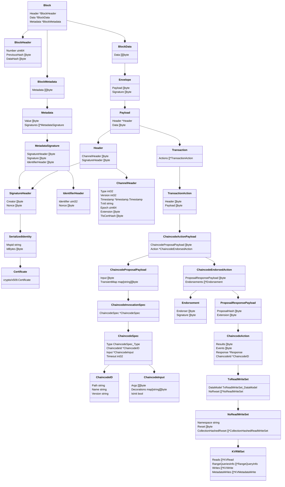

# 从源码中解析fabric区块数据结构（一）

## 前言

最近打算基于[fabric-sdk-go](https://github.com/hyperledger/fabric-sdk-go)实现[hyperledger fabric](https://hyperledger-fabric.readthedocs.io/en/latest/getting_started.html)浏览器，其中最重要的一步就是解析fabric的上链区块。虽说fabric是**Golang**实现的，但直到[2021年2月1号](https://github.com/hyperledger/fabric-sdk-go/releases)才发布了第一个稳定版**fabric-sdk-go**，而且官方几乎没有响应的文档介绍。对于fabric-sdk-go，基本都是参照源码中的测试用例来使用；而要实现区块链浏览器，仅靠测试用例还差好多，特别是对出块信息的解析。

通过`event.Client.RegisterBlockEvent()`可以监听fabric的出块事件，但返回的信息中有用的是一个`BlockEvent`类型的`chan`，定义如下：

```go
// BlockEvent contains the data for the block event
type BlockEvent struct {
	// Block is the block that was committed
	Block *cb.Block
	// SourceURL specifies the URL of the peer that produced the event
	SourceURL string
}
```

区块链浏览器需要的所有信息基本都包含在`Block`中，其定义如下：

```go
// This is finalized block structure to be shared among the orderer and peer
// Note that the BlockHeader chains to the previous BlockHeader, and the BlockData hash is embedded
// in the BlockHeader.  This makes it natural and obvious that the Data is included in the hash, but
// the Metadata is not.
type Block struct {
	Header               *BlockHeader   `protobuf:"bytes,1,opt,name=header,proto3" json:"header,omitempty"`
	Data                 *BlockData     `protobuf:"bytes,2,opt,name=data,proto3" json:"data,omitempty"`
	Metadata             *BlockMetadata `protobuf:"bytes,3,opt,name=metadata,proto3" json:"metadata,omitempty"`
}
```

本文作为区块链浏览器系列的开篇，结构体中各字段的含义会在之后的文章中一一介绍，这里就不再过多介绍。接下来将以类图的形式来解析区块中包含的信息。



---

> 声明：本作品采用[署名-非商业性使用-相同方式共享 4.0 国际 (CC BY-NC-SA 4.0)](https://creativecommons.org/licenses/by-nc-sa/4.0/deed.zh)进行许可，使用时请注明出处。
> Author: mengbin92
> Github: [mengbin92](https://mengbin92.github.io/)
> cnblogs: [恋水无意](https://www.cnblogs.com/lianshuiwuyi/)

---
