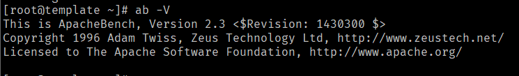

[toc]  

# ab命令介绍  

网站性能压力测试是网站性能调优过程中必不可少的一个环节。只有服务器处于高压情况下，才能暴露出软件、硬件等各种设置的不当之处。  

性能测试的工具有很多，这里介绍主要介绍ab。  

ab是apache自带的压力测试工具，不仅可以对apache服务器进行网站访问压力测试，还可以对其它类型的服务器进行压力测试。  

ab全称apachebench，其工作原理是创建多个并发访问的线程，来模拟多个访问者同时对某个URL进行访问。  

## 安装  

* 如果已安装了apache服务，可以使用`which ab`命令查看ab的安装位置。  
* 如果不想安装apache，又想使用ab命令，CentOS下可以使用`yum install -y httpd-tools`来安装  

安装完成后，执行`ab -V`，会显示ab版本信息，如下图：  

   

## 参数说明  

`ab --help`可以查看ab命令的所有参数：  

* **-n requests**：执行请求的数量
* **-c concurrency**：同一时间请求的并发量
* **-t timelimit**：单个测试最大时长，隐含`-n 50000`
* **-s timeout**：每个响应的最长等待时间，默认30s
* **-b windowsize**：TCP发送/接收缓存大小，字节为单位
* **-B address**：外部连接时绑定的地址
* **-p postfile**：包含POST数据的文件，需要与`-T`一起使用
* **-u putfile**：包含PUT数据的文件，需要与`-T`一起使用
* **-T content-type**：POST或PUT数据时指定Content-type头，例如'application/x-www-form-urlencoded'，默认为'text/plain'
* **-v verbosity**：输出排除信息的详尽程度
* **-w**：结果输出到HTML表格中
* **-i**：使用HEAD代替GET
* **-x attributes**：设置table属性
* **-y attributes**：设置tr属性
* **-z attributes**：设置td或th属性
* **-C attributes**：添加cookie，例如'Apache=1234'，可重复
* **-H attributes**：添加header信息，例如'Accept-Encoding: gzip'，在所有常用header后插入，可重复
* **-A attributes**：添加基础WWW认证信息，属性值为冒号连接的用户名密码
* **-P attributes**：添加基础的代理信息，属性值为冒号连接的用户名密码
* **-X proxy:port**：使用的代理服务和端口
* **-V**：输出版本信息
* **-k**：使用HTTP KeepAlive属性
* **-d**：不显示百分比服务表格
* **-S**：不显示预估和告警信息
* **-q**：当超过150条请求时不显示进度
* **-g filename**：测试结果输出到gnuplot格式的文件
* **-e filename**：将百分比服务输出到CSV文件中
* **-r**：socket接收出错时不退出
* **-h**：展示帮助信息
* **-Z ciphersuite**：指定SSL/TLS加密套件（详见openssl ciphers）
* **-f protocol**：指定SSL/TLS协议（SSL3, TLS1, TLS1.1, TLS1.2 or ALL）  

## 性能指标  

性能测试时主要关注以下几个性能指标：  

### 吞吐率（Requests per second）

服务器并发处理能力的量化表示，单位reqs/s，指服务器单位时间内处理的并发请求数。  

吞吐率是基于并发用户的，即：  

* 吞吐率和并发用户数量有关
* 不同并发用户数量下，吞吐率一般不同

该数值表示当前机器的整体性能，数值越大越好。  

### 单个请求等待时间  

处理完所有请求花费的时间/（总请求数/并发用户数量）

### 服务器平均等待时间  

处理完所有请求花费的时间/总请求数  

---

> 声明：本作品采用[署名-非商业性使用-相同方式共享 4.0 国际 (CC BY-NC-SA 4.0)](https://creativecommons.org/licenses/by-nc-sa/4.0/deed.zh)进行许可，使用时请注明出处。
> Author: MonsterMeng92

---